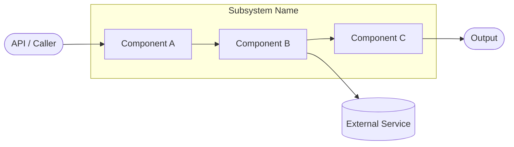

# CloudOps AI Subsystem Architecture Review Template

> **Standard Version:** 1.0 — Frozen. Do not add sections without a formal change request.

---

## Metadata

| Field | Value |
|-------|-------|
| Review Version | 1.0 |
| Review Date | YYYY-MM-DD |
| Reviewer | Your Name |
| Subsystem Version | v1.x (optional) |
| Status | Draft / Approved |
| Code Version | `git rev-parse --short HEAD` |

---

## 1. Overview

*One paragraph. What is this subsystem? What is its role in the CloudOps AI platform?*

---

## 2. Purpose

- **Why it exists:** Business or technical problem it solves.
- **Primary responsibilities:** What it does.
- **Out of scope / Never does:** Hard boundaries.

---

## 3. Architecture Diagram



---

## 4. Workflow

```
User / API
    ↓
Entry Point (API route / internal caller)
    ↓
Core Processing (subsystem logic)
    ↓
Dependencies (internal services / external systems)
    ↓
Output (JSON response / model / event)
```

*Describe each step. Note any async or streaming behavior.*

---

## 5. Public APIs

| Method | Path | Purpose |
|--------|------|---------|
| GET | `/api/v1/...` | Description |
| POST | `/api/v1/...` | Description |

### Internal APIs (used by other subsystems)

| Caller | Method / Function | Purpose |
|--------|------------------|---------|
| `AIEngine` | `subsystem.method()` | Description |

---

## 6. Components

| Component | File | Responsibility | Used By | Depends On | Input | Output | Status |
|-----------|------|----------------|---------|------------|-------|--------|--------|
| `ComponentA` | `path/to/file.py` | What it does | Callers | Dependencies | InputModel | OutputModel | ✅ Keep |
| `ComponentB` | `path/to/file.py` | What it does | Callers | Dependencies | InputModel | OutputModel | 🟡 Improve |

---

## 7. Data Flow

```
InputModel
    ↓
ComponentA.method(input) → IntermediateModel
    ↓
ComponentB.method(intermediate) → OutputModel
    ↓
API Response / Caller
```

---

## 8. Input Models

| Model | Fields | Description |
|-------|--------|-------------|
| `InputModel` | `field1: str`, `field2: int` | Description |

---

## 9. Output Models

| Model | Fields | Description |
|-------|--------|-------------|
| `OutputModel` | `field1: str`, `field2: List[str]` | Description |

---

## 10. Dependencies

### Internal
- `ServiceA` – used for X.
- `ServiceB` – used for Y.

### External
| System | Purpose | Connection |
|--------|---------|-----------|
| Neo4j | Graph queries | `neo4j_service.py` |
| PostgreSQL | Relational data | `database.py` |
| Ollama | LLM generation | `ollama_service.py` |
| Qdrant | Vector search | `qdrant_service.py` |

---

## 11. Strengths

- Well-designed aspect 1.
- Well-designed aspect 2.

---

## 12. Weaknesses

- Current limitation 1.
- Current limitation 2.

---

## 13. Current Technical Debt

- [ ] Known debt item 1 (e.g., hard-coded rules).
- [ ] Known debt item 2 (e.g., missing error handling).

---

## 14. Improvements (Future Work)

- Planned enhancement 1 — not for immediate implementation.
- Planned enhancement 2.

---

## 15. Roadmap

### Short-Term (Next Sprint)
- Immediate goal 1.
- Immediate goal 2.

### Long-Term (Future Vision)
- Strategic goal 1.
- Strategic goal 2.

---

## 16. Testing

| Type | Coverage | Notes |
|------|----------|-------|
| Unit Tests | 0% | Not implemented |
| Integration Tests | 0% | Not implemented |
| API Tests | 0% | Not implemented |
| Performance Tests | 0% | Not implemented |

---

## 17. Production Readiness

| Area | Status | Notes |
|------|--------|-------|
| Logging | ✅ | Structured logging via Python `logging` |
| Metrics | 🟡 | Partial implementation |
| Retry Logic | ❌ | Not implemented |
| Circuit Breaker | ❌ | Not implemented |
| Monitoring | 🟡 | Basic health endpoint only |
| Tests | ❌ | No test coverage |
| Documentation | ✅ | This document |

---

## 18. Final Verdict

**Decision:** Keep / Improve / Remove

**Confidence:** X%

**Priority:** Low / Medium / High

**Justification:** Brief rationale.

---

## 19. Design Decisions (ADR)

### Decision 1: [Title]
- **Decision:** What was decided.
- **Reason:** Why this choice was made.
- **Alternatives Considered:** What else was evaluated.
- **Why Rejected:** Why the alternative was not chosen.

---

## 20. Security Considerations

- **Authentication:** How callers are authenticated.
- **Authorization:** RBAC, org isolation, least privilege.
- **Secrets Management:** AWS Secrets Manager / environment variables / vault.
- **Data Protection:** At-rest encryption, TLS, sensitive field masking.
- **Audit Logging:** What privileged actions are logged.

---

## 21. Failure Scenarios

| Dependency Failure | Impact | Fallback | Recovery |
|-------------------|--------|----------|---------|
| Neo4j unavailable | Graph queries fail | PostgreSQL fallback | Retry with exponential backoff |
| Ollama unavailable | AI generation fails | Return graceful error | Circuit breaker after N failures |

---

## 22. Performance Characteristics

| Metric | Value |
|--------|-------|
| Expected Response Time | < 2 seconds |
| Max Context Size | 8,000 characters |
| Max Graph Depth | 5 hops |
| Concurrent Requests | 100+ |
| Cache | None / Redis (TTL Xm) |

---

## 23. Related Subsystems

```
[This Subsystem]
    ↑ Consumes from
    [Subsystem A]
    [Subsystem B]

    ↓ Produces for
    [Subsystem C]
    [Subsystem D]
```

| Uses | Used By |
|------|---------|
| Subsystem A | Subsystem C |
| Subsystem B | Subsystem D |

---

*CloudOps AI Architecture Review Template v1.0 — Frozen. Generated by Antigravity AI.*
