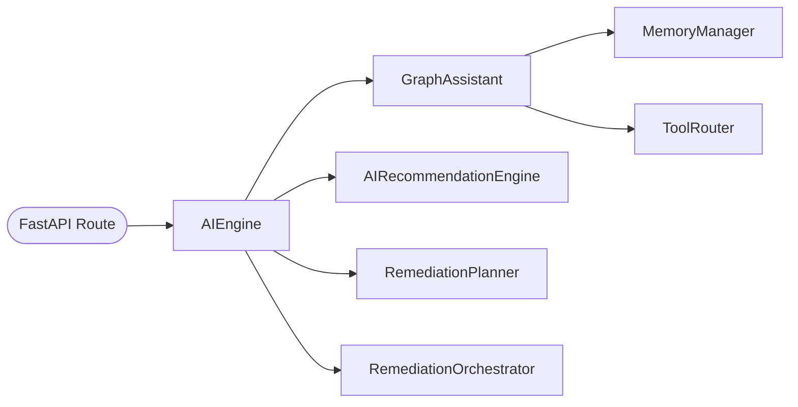

# 01 — AI Engine

| Field | Value |
|-------|-------|
| Review Version | 1.0 |
| Review Date | 2026-07-10 |
| Reviewer | Kishore Suzil |
| Status | Approved |
| Code Version | `13d1019` |

---

## 1. Overview

The AI Engine (`AIEngine`) is the **unified facade** over all AI capabilities in the CloudOps AI platform. It aggregates chat, recommendation, remediation planning, and orchestration into a single entry point, preventing API routers from having direct knowledge of which subsystem to call. Every AI-related API route delegates to `AIEngine`.

---

## 2. Purpose

- **Why it exists:** Provides a single, stable interface for all AI operations, decoupling API routes from internal AI subsystems.
- **Primary responsibilities:**
  - Route `chat()` calls to `GraphAssistant`.
  - Route `recommend()` calls to `AIRecommendationEngine`.
  - Route `plan_remediation()` calls to `RemediationPlanner`.
  - Route `build_orchestration()` calls to `RemediationOrchestrator`.
  - Expose the tool registry via `get_tools()`.
- **Never does:** It does not implement any AI logic itself. It is a pure facade/delegator.

---

## 3. Architecture Diagram



---

## 4. Workflow

```
FastAPI Route (POST /api/v1/ai/chat)
    ↓
AIEngine.chat(request, stream)
    ↓
GraphAssistant.chat(request, stream)
    ↓
[Intent Classification → Tool Routing → Context Building → LLM Generation]
    ↓
ChatResponse
```

For recommendations:
```
FastAPI Route (GET /api/v1/ai/recommendations)
    ↓
AIEngine.recommend(resource_id, category)
    ↓
AIRecommendationEngine.analyze_resource() or analyze_environment()
    ↓
List[Recommendation]
```

---

## 5. Public APIs

| Method | Path | Purpose |
|--------|------|---------|
| POST | `/api/v1/ai/chat` | Submit a chat message |
| GET | `/api/v1/ai/recommendations` | Get AI recommendations |
| POST | `/api/v1/ai/actions/remediation` | Plan environment remediation |
| POST | `/api/v1/ai/actions/remediation/{resource_id}` | Plan resource-specific remediation |
| GET | `/api/v1/ai/tools` | List available AI tools |

### Internal APIs

| Caller | Method | Purpose |
|--------|--------|---------|
| `api/v1/ai.py` | `AIEngine.chat()` | Process user chat messages |
| `api/v1/ai.py` | `AIEngine.recommend()` | Fetch recommendations |
| `api/v1/ai.py` | `AIEngine.build_orchestration()` | Fetch execution packages |

---

## 6. Components

| Component | File | Responsibility | Used By | Depends On | Input | Output | Status |
|-----------|------|----------------|---------|------------|-------|--------|--------|
| `AIEngine` | `services/ai/engine.py` | Facade for all AI subsystems | `api/v1/ai.py` | `GraphAssistant`, `AIRecommendationEngine`, `RemediationPlanner`, `RemediationOrchestrator` | `ChatRequest`, `resource_id`, `category` | `ChatResponse`, `List[Recommendation]`, `List[ExecutionPackage]` | ✅ Keep |

---

## 7. Data Flow

```
ChatRequest → AIEngine.chat() → GraphAssistant.chat() → ChatResponse
resource_id → AIEngine.recommend() → AIRecommendationEngine → List[Recommendation]
resource_id → AIEngine.build_orchestration() → RemediationOrchestrator → List[ExecutionPackage]
```

---

## 8. Input Models

| Model | Fields | Description |
|-------|--------|-------------|
| `ChatRequest` | `message: str`, `conversation_id: str` | User chat message |
| `resource_id` | `str` (optional) | AWS resource identifier |
| `category` | `str` (optional) | Recommendation category filter |

---

## 9. Output Models

| Model | Fields | Description |
|-------|--------|-------------|
| `ChatResponse` | `answer: str`, `intent: str`, `resource: str`, `sources: List`, `confidence: float`, `evidence: List`, `tools_used: List` | AI chat response |
| `List[Recommendation]` | See Recommendation System | AI recommendations |
| `List[ExecutionPackage]` | See Orchestration System | Remediation execution packages |

---

## 10. Dependencies

### Internal
- `GraphAssistant` – handles conversational AI.
- `AIRecommendationEngine` – generates resource/environment recommendations.
- `RemediationPlanner` – produces abstract remediation plans.
- `RemediationOrchestrator` – produces full execution packages.

### External
| System | Purpose |
|--------|---------|
| Ollama | Via GraphAssistant → OllamaProvider |
| Neo4j | Via tool execution inside GraphAssistant |
| Qdrant | Via RAG service inside tool execution |

---

## 11. Strengths

- Clean facade pattern — API routes have no direct dependency on any AI subsystem.
- Supports streaming (`stream=True`) transparently.
- Optional `memory_manager` injection for testing.
- Stateless — each request creates fresh subsystem instances.

---

## 12. Weaknesses

- Instantiates subsystems on every call (no shared singleton state for `AIRecommendationEngine`, etc.).
- No error handling at the facade level — errors propagate raw to the API layer.
- No request timeout enforcement at this layer.

---

## 13. Current Technical Debt

- [ ] Subsystems instantiated on every request — consider lazy singletons.
- [ ] No structured error wrapping at the facade layer.
- [ ] `get_tools()` creates a `GraphAssistant` just to access the tool registry — wasteful.

---

## 14. Improvements (Future Work)

- Add facade-level error handling with structured error responses.
- Cache `AIRecommendationEngine` and `RemediationOrchestrator` as singletons.
- Add request-level tracing IDs that propagate through all subsystems.

---

## 15. Roadmap

### Short-Term
- Add facade-level exception handling.
- Propagate `request_id` through all subsystem calls.

### Long-Term
- Support pluggable AI providers (swap Ollama for OpenAI, Bedrock, etc.) at the engine level.
- Add an async version of `recommend()` and `build_orchestration()`.

---

## 16. Testing

| Type | Coverage | Notes |
|------|----------|-------|
| Unit Tests | 0% | Not implemented |
| Integration Tests | 0% | Not implemented |
| API Tests | 0% | Not implemented |
| Performance Tests | 0% | Not implemented |

---

## 17. Production Readiness

| Area | Status | Notes |
|------|--------|-------|
| Logging | 🟡 | Logging is in subsystems, not at engine level |
| Metrics | ❌ | No facade-level metrics |
| Retry Logic | ❌ | Delegated to subsystems |
| Circuit Breaker | ❌ | Not implemented |
| Monitoring | 🟡 | Via underlying subsystem monitoring |
| Tests | ❌ | No test coverage |
| Documentation | ✅ | This document |

---

## 18. Final Verdict

**Decision:** ✅ Keep

**Confidence:** 95%

**Priority:** High

**Justification:** The facade pattern is the correct architectural choice. The weaknesses are implementation gaps (error handling, singletons), not design flaws.

---

## 19. Design Decisions (ADR)

### Decision 1: Facade over direct subsystem calls
- **Decision:** API routes call `AIEngine`, not individual subsystems.
- **Reason:** Decouples API layer from internal AI architecture. New subsystems can be added without touching API routes.
- **Alternatives Considered:** Direct service injection into routes.
- **Why Rejected:** Creates tight coupling; every new AI feature requires changing API route files.

---

## 20. Security Considerations

- No authentication/authorization at this layer — handled by FastAPI middleware.
- `resource_id` inputs are passed to Neo4j queries — must be validated upstream.
- No secrets stored in `AIEngine`.

---

## 21. Failure Scenarios

| Failure | Impact | Fallback |
|---------|--------|---------|
| `GraphAssistant` raises | Chat request fails | Propagates 500 to caller |
| `AIRecommendationEngine` raises | Recommendations fail | Propagates 500 to caller |
| Ollama unavailable | Chat returns LLM error JSON | `OllamaProvider` handles and returns structured error |

---

## 22. Performance Characteristics

| Metric | Value |
|--------|-------|
| Expected Response Time | < 5 seconds (LLM dependent) |
| Streaming Support | ✅ Yes |
| Concurrent Requests | Limited by Ollama model throughput |
| Caching | None at this layer |

---

## 23. Related Subsystems

| Uses | Used By |
|------|---------|
| Graph Assistant | `api/v1/ai.py` |
| Recommendation System | API routes |
| Remediation System | API routes |
| Orchestration System | API routes |
