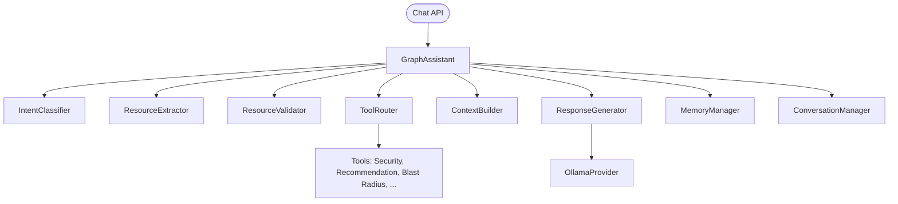

# 02 — Graph Assistant

| Field | Value |
|-------|-------|
| Review Version | 1.0 |
| Review Date | 2026-07-10 |
| Reviewer | Kishore Suzil |
| Status | Approved |
| Code Version | `13d1019` |

---

## 1. Overview

The Graph Assistant (`GraphAssistant`) is the **primary conversational AI agent** in the CloudOps AI platform. It processes user messages, classifies intent, extracts and validates resource references, routes to specialized tools (security, recommendations, blast radius, etc.), builds a structured prompt context, and generates a response via the LLM provider. It is the most complex and critical subsystem in the platform.

---

## 2. Purpose

- **Why it exists:** Provides a CloudOps-aware conversational AI that can answer questions about specific AWS resources, security findings, costs, dependencies, and recommendations.
- **Primary responsibilities:**
  - Intent classification.
  - Resource extraction and validation.
  - Tool routing (security, recommendations, blast radius, etc.).
  - Conversation history and memory management.
  - LLM prompt construction and response generation.
- **Never does:** It does not directly query AWS, Neo4j, or PostgreSQL — it delegates to specialized tools and services.

---

## 3. Architecture Diagram



---

## 4. Workflow

```
POST /api/v1/ai/chat
    ↓
AIEngine.chat(request)
    ↓
GraphAssistant.chat(request)
    ↓
1. IntentClassifier.classify(message) → intent_data
2. ResourceExtractor.extract(message) → candidate resource
3. ResourceValidator.resolve(candidate) → resolved resource
4. ConversationManager.process_turn() → conversation context
5. MemoryManager.add_message() → persist user message
6. ToolRouter.route(intent, resource) → tool_responses
7. ContextBuilder.build_structured_context() → context string
8. ConversationManager.get_formatted_history() → history string
9. MemoryManager.summarize_memory() → memory summary
10. ResponseGenerator.generate() → ChatResponse
11. MemoryManager.add_message() → persist assistant response
    ↓
ChatResponse
```

---

## 5. Public APIs

| Method | Path | Purpose |
|--------|------|---------|
| POST | `/api/v1/ai/chat` | Submit a user chat message |

### Internal APIs

| Caller | Method | Purpose |
|--------|--------|---------|
| `AIEngine` | `GraphAssistant.chat()` | Process conversational messages |

---

## 6. Components

| Component | File | Responsibility | Used By | Depends On | Input | Output | Status |
|-----------|------|----------------|---------|------------|-------|--------|--------|
| `GraphAssistant` | `assistant/graph_assistant.py` | Orchestrates the full chat pipeline | `AIEngine` | All listed below | `ChatRequest` | `ChatResponse` | ✅ Keep |
| `IntentClassifier` | `assistant/intent_classifier.py` | Classifies user message intent | `GraphAssistant` | None | `str` | `Dict` (intent, confidence) | ✅ Keep |
| `ResourceExtractor` | `assistant/resource_extractor.py` | Extracts resource IDs from messages | `GraphAssistant` | None | `str` | `str` (candidate) | ✅ Keep |
| `ResourceValidator` | `assistant/resource_validator.py` | Validates and resolves resource IDs via Neo4j | `GraphAssistant` | Neo4j | `str` | `ValidationResult` | ✅ Keep |
| `ToolRouter` | `assistant/tool_router.py` | Routes intent to the appropriate tool | `GraphAssistant` | `ToolRegistry` | intent, resource | `List[ToolResponse]` | ✅ Keep |
| `ContextBuilder` | `assistant/context/context_builder.py` | Builds structured LLM prompt context | `GraphAssistant` | None | context, tool_responses | `str` | ✅ Keep |
| `ResponseGenerator` | `assistant/response/response_generator.py` | Generates the final response via LLM | `GraphAssistant` | `OllamaProvider` | prompt, history | `ChatResponse` | ✅ Keep |
| `MemoryManager` | `assistant/memory/memory_manager.py` | Manages conversation memory | `GraphAssistant` | `MemoryStore` | session_id, messages | context, history | ✅ Keep |
| `ConversationManager` | `assistant/conversation/conversation_manager.py` | Tracks conversation state and history | `GraphAssistant` | `MemoryManager`, `HistoryManager` | conversation context | `ConversationContext` | ✅ Keep |

---

## 7. Data Flow

```
ChatRequest(message, conversation_id)
    ↓ IntentClassifier → {intent, confidence}
    ↓ ResourceExtractor → candidate_resource_id
    ↓ ResourceValidator → ResolvedResource(resource_id, resource_type, confidence, suggestions)
    ↓ ConversationManager → ConversationContext
    ↓ ToolRouter → List[ToolResponse]
    ↓ ContextBuilder → context_str
    ↓ ResponseGenerator → ChatResponse(answer, intent, resource, sources, confidence, evidence, tools_used)
```

---

## 8. Input Models

| Model | Fields | Description |
|-------|--------|-------------|
| `ChatRequest` | `message: str`, `conversation_id: str` | User chat request |

---

## 9. Output Models

| Model | Fields | Description |
|-------|--------|-------------|
| `ChatResponse` | `answer: str`, `intent: str`, `resource: str`, `sources: List`, `confidence: float`, `evidence: List`, `tools_used: List` | Full AI response with attribution |

---

## 10. Dependencies

### Internal
- `MemoryManager` / `MemoryStore` – conversation memory.
- `ToolRouter` / `ToolRegistry` – tool dispatch.
- `ContextBuilder` – prompt context assembly.
- `ResponseGenerator` – LLM interaction.

### External
| System | Purpose |
|--------|---------|
| Ollama | LLM text generation |
| Neo4j | Resource validation, tool execution |
| Qdrant | Documentation retrieval (via `DocumentationTool`) |

---

## 11. Strengths

- Clean pipeline with each step isolated in its own class.
- Resource validation with fuzzy suggestions prevents hallucination on unknown resources.
- Logging of intent, resource, tool, prompt length, context length, and model per request.
- Memory summarization provides a compressed context for long conversations.

---

## 12. Weaknesses

- Memory is in-process only — lost on restart, not scalable horizontally.
- No timeout enforcement per pipeline step.
- `print()` statements mixed with structured logging.
- Numbered pipeline comments are inconsistent (e.g., two "# 5." steps).

---

## 13. Current Technical Debt

- [ ] Inconsistent step numbering in `chat()` method comments.
- [ ] `print()` statements should be replaced with `logger.debug()`.
- [ ] `MemoryStore` is in-process — no persistence or horizontal scaling.
- [ ] No request-level timeout or cancellation mechanism.

---

## 14. Improvements (Future Work)

- Replace in-process `MemoryStore` with Redis-backed store for horizontal scaling.
- Add per-step timing metrics.
- Add structured error response when tool execution fails.
- Support async streaming at the assistant level.

---

## 15. Roadmap

### Short-Term
- Fix step numbering in `chat()`.
- Replace `print()` with structured logging.

### Long-Term
- Redis-backed memory store.
- Async pipeline execution for parallel tool calls.
- Multi-agent orchestration (delegate complex tasks to specialized sub-agents).

---

## 16. Testing

| Type | Coverage | Notes |
|------|----------|-------|
| Unit Tests | 0% | Not implemented |
| Integration Tests | 0% | Not implemented |
| API Tests | 0% | Not implemented |
| Performance Tests | 0% | Not implemented |

---

## 17. Production Readiness

| Area | Status | Notes |
|------|--------|-------|
| Logging | 🟡 | Structured logging present; `print()` statements remain |
| Metrics | 🟡 | LLM request time logged; no metrics exported |
| Retry Logic | ❌ | Delegated to OllamaProvider |
| Circuit Breaker | ❌ | Not implemented |
| Monitoring | 🟡 | Basic logging only |
| Tests | ❌ | No coverage |
| Documentation | ✅ | This document |

---

## 18. Final Verdict

**Decision:** ✅ Keep

**Confidence:** 95%

**Priority:** High

**Justification:** The pipeline architecture is well-designed and extensible. Weaknesses are operational gaps, not fundamental design flaws.

---

## 19. Design Decisions (ADR)

### Decision 1: Sequential pipeline with short-circuit on missing resources
- **Decision:** If a resource is mentioned but not found, return an error immediately without calling the LLM.
- **Reason:** Prevents LLM hallucination on unknown resources.
- **Alternatives Considered:** Let the LLM handle unknown resources.
- **Why Rejected:** LLM would fabricate plausible-sounding but incorrect resource details.

---

## 20. Security Considerations

- Resource IDs from user messages are validated against Neo4j before use.
- No secrets stored in GraphAssistant.
- Conversation data is in-process only; no external persistence.

---

## 21. Failure Scenarios

| Failure | Impact | Fallback |
|---------|--------|---------|
| Ollama unavailable | Response generation fails | `OllamaProvider` returns structured error JSON |
| Neo4j unavailable | Resource validation fails | `ResourceValidator` returns low-confidence result |
| Tool execution raises | Tool response is empty | Pipeline continues with empty tool context |

---

## 22. Performance Characteristics

| Metric | Value |
|--------|-------|
| Expected Response Time | 2–8 seconds (LLM dependent) |
| Streaming Support | ✅ Yes |
| History Limit | Last 5 turns |
| Concurrent Requests | Limited by Ollama throughput |
| Memory | In-process dictionary |

---

## 23. Related Subsystems

| Uses | Used By |
|------|---------|
| Memory System | AI Engine |
| Tool Router / Tool Registry | AI Engine |
| LLM Provider Layer | AI Engine |
| Response Generation | AI Engine |
| Graph System (via tools) | API routes |
