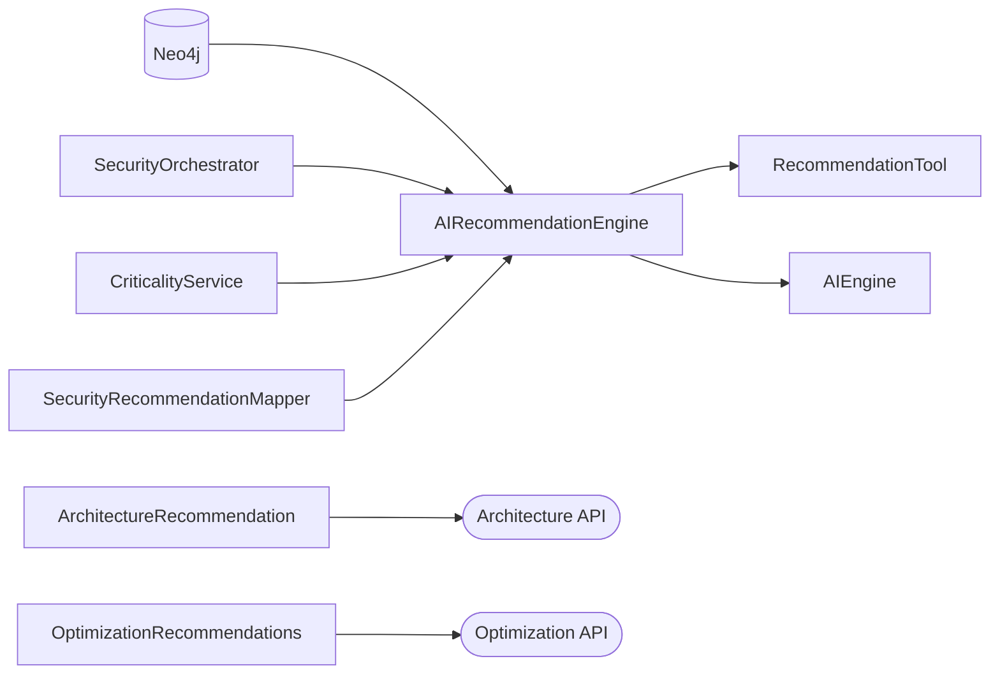

# 03 — Recommendation System

| Field | Value |
|-------|-------|
| Review Version | 1.0 |
| Review Date | 2026-07-10 |
| Reviewer | Kishore Suzil |
| Status | Approved |
| Code Version | `13d1019` |

---

## 1. Overview

The Recommendation System analyzes the cloud environment using graph analysis, security analysis, criticality scoring, and AI reasoning to produce actionable CloudOps recommendations. It answers: **"Given the current cloud environment, what should the user improve?"** It does not execute changes.

---

## 2. Purpose

- **Why it exists:** Surfaces risks and improvements proactively, before incidents occur.
- **Primary responsibilities:** Generate AI-driven, security, architecture, and cost optimization recommendations.
- **Never does:** Execute changes, modify AWS resources, or directly trigger remediation.

---

## 3. Architecture Diagram



---

## 4. Workflow

```
API: GET /api/v1/ai/recommendations?resource_id=<id>
    ↓
AIEngine.recommend(resource_id)
    ↓
AIRecommendationEngine.analyze_resource(resource_id)
    ↓
1. CriticalityService.calculate(resource_id) → criticality_data
2. GraphAnalysisService queries Neo4j → graph_context
3. SecurityOrchestrator.analyze(resource_id) → security_findings
4. PromptBuilder.build(query, context, architecture_context) → prompt
5. OllamaService.generate(prompt) → ai_analysis
    ↓
List[Recommendation]
```

---

## 5. Public APIs

| Method | Path | Purpose |
|--------|------|---------|
| GET | `/api/v1/ai/recommendations` | Get environment-wide recommendations |
| GET | `/api/v1/ai/recommendations?resource_id=<id>` | Get resource-specific recommendations |
| GET | `/api/v1/architecture/recommendation` | Get architecture best-practice recommendations |
| GET | `/api/v1/optimization` | Get cost optimization recommendations |

### Internal APIs

| Caller | Method | Purpose |
|--------|--------|---------|
| `AIEngine` | `AIRecommendationEngine.analyze_resource()` | Resource-level AI recommendations |
| `AIEngine` | `AIRecommendationEngine.analyze_environment()` | Environment-wide recommendations |
| `RecommendationTool` | `AIRecommendationEngine.analyze_resource()` | Chat-driven recommendation requests |

---

## 6. Components

| Component | File | Responsibility | Used By | Depends On | Input | Output | Status |
|-----------|------|----------------|---------|------------|-------|--------|--------|
| `AIRecommendationEngine` | `services/ai/recommendation_engine.py` | Primary AI recommendation engine | `AIEngine`, `RecommendationTool` | Neo4j, CriticalityService, SecurityOrchestrator, Ollama | `resource_id` or none | `List[Recommendation]` | ✅ Keep |
| `RecommendationTool` | `services/ai/assistant/tools/recommendation_tool.py` | Adapter: exposes `AIRecommendationEngine` to chat tools | `ToolRouter` | `AIRecommendationEngine` | intent, resource | `ToolResponse` | ✅ Keep |
| `ArchitectureRecommendation` | `services/ai/architecture_recommendation.py` | Architecture best-practice guidance (mostly static rules) | API route | None | resource metadata | `List[str]` | 🟡 Improve |
| `SecurityRecommendationMapper` | `services/graph/analysis/security/recommendation_engine.py` | Maps security findings → remediation advice | `AIRecommendationEngine` | SecurityOrchestrator | security findings | `List[Recommendation]` | 🟡 Keep, rename |
| `OptimizationRecommendations` | `services/optimization/recommendations.py` | Cost optimization recommendations for EC2/RDS/EBS | API route | pricing data | resource inventory | `List[Recommendation]` | ✅ Keep |

---

## 7. Data Flow

```
resource_id
    ↓ CriticalityService → {criticality_score, blast_radius, criticality_level, details}
    ↓ GraphAnalysisService → graph_context (neighbors, relationships)
    ↓ SecurityOrchestrator → security_findings
    ↓ PromptBuilder → prompt string
    ↓ OllamaService → ai_analysis string
    ↓ Recommendation(category, priority, description, evidence, resource_id)
```

---

## 8. Input Models

| Model | Fields | Description |
|-------|--------|-------------|
| `resource_id` | `str` (optional) | AWS resource identifier |
| `category` | `str` (optional) | Filter by recommendation category |

---

## 9. Output Models

| Model | Fields | Description |
|-------|--------|-------------|
| `Recommendation` | `category: str`, `priority: str`, `description: str`, `evidence: List`, `resource_id: str` | Single recommendation |

---

## 10. Dependencies

### Internal
- `CriticalityService` – blast radius and criticality scoring.
- `GraphAnalysisService` – graph-based context for AI.
- `SecurityOrchestrator` – security findings.
- `PromptBuilder` – LLM prompt construction.
- `OllamaService` – LLM generation.

### External
| System | Purpose |
|--------|---------|
| Neo4j | Graph context for resource dependencies |
| Ollama | AI recommendation generation |

---

## 11. Strengths

- Clear domain separation: AI, architecture, security, and cost recommendations are isolated.
- `RecommendationTool` correctly acts as an adapter — no business logic.
- Tool registry integration allows chat-driven recommendations.
- Modular design makes it easy to add new recommendation categories.

---

## 12. Weaknesses

- `ArchitectureRecommendation` is mostly hard-coded static rules.
- `SecurityRecommendationMapper` is named `RecommendationEngine` — misleading.
- No unified recommendation data model across all engines.
- No deduplication across recommendation sources.

---

## 13. Current Technical Debt

- [ ] `ArchitectureRecommendation` relies on static rules rather than dynamic analysis.
- [ ] `SecurityRecommendationMapper` is misnamed as `RecommendationEngine`.
- [ ] No common `Recommendation` schema enforced across all engines.
- [ ] No deduplication when multiple engines produce overlapping recommendations.

---

## 14. Improvements (Future Work)

- Rename `SecurityRecommendationMapper` for clarity.
- Integrate graph analysis, security findings, and AI into `ArchitectureRecommendation`.
- Enforce a unified `Recommendation` model across all engines.
- Add deduplication and priority merging across recommendation sources.

---

## 15. Roadmap

### Short-Term
- Rename `SecurityRecommendationMapper`.
- Standardize `Recommendation` model fields.

### Long-Term
- Build a unified recommendation aggregator that merges AI, security, architecture, and cost recommendations into a single ranked list.

---

## 16. Testing

| Type | Coverage | Notes |
|------|----------|-------|
| Unit Tests | 0% | Not implemented |
| Integration Tests | 0% | Not implemented |
| API Tests | 0% | Not implemented |
| Performance Tests | 0% | Not implemented |

---

## 17. Production Readiness

| Area | Status | Notes |
|------|--------|-------|
| Logging | 🟡 | Basic print statements |
| Metrics | ❌ | Not implemented |
| Retry Logic | ❌ | Not implemented |
| Circuit Breaker | ❌ | Not implemented |
| Monitoring | ❌ | Not implemented |
| Tests | ❌ | No coverage |
| Documentation | ✅ | This document |

---

## 18. Final Verdict

**Decision:** 🟡 Keep and Improve

**Confidence:** 90%

**Priority:** High

**Justification:** Solid separation of concerns. Main gaps are naming clarity, static rules in ArchitectureRecommendation, and lack of a unified data model.

---

## 19. Design Decisions (ADR)

### Decision 1: Separate recommendation engines per domain
- **Decision:** Keep AI, security, architecture, and cost recommendations in separate engines.
- **Reason:** Each domain has different inputs, rules, and expertise. A single monolithic engine would be hard to maintain.
- **Alternatives Considered:** Single unified recommendation engine.
- **Why Rejected:** Different engines require different data sources and analysis strategies.

---

## 20. Security Considerations

- Recommendations are read-only — no cloud changes occur.
- Resource IDs used as inputs must be validated by the caller.
- No secrets stored in recommendation engines.

---

## 21. Failure Scenarios

| Failure | Impact | Fallback |
|---------|--------|---------|
| Neo4j unavailable | Graph context unavailable | Engine returns partial recommendations |
| Ollama unavailable | AI recommendations fail | Engine returns security/cost recommendations only |
| CriticalityService fails | No criticality data | Engine uses default values |

---

## 22. Performance Characteristics

| Metric | Value |
|--------|-------|
| Expected Response Time | 3–10 seconds (LLM dependent) |
| Environment-Wide Analysis | Iterates all resources — may be slow at scale |
| Concurrent Requests | Limited by Ollama |
| Caching | None |

---

## 23. Related Subsystems

| Uses | Used By |
|------|---------|
| Graph System | AI Engine |
| Security System | Chat (via RecommendationTool) |
| LLM Provider Layer | API routes |
| Criticality Service | Remediation System |
