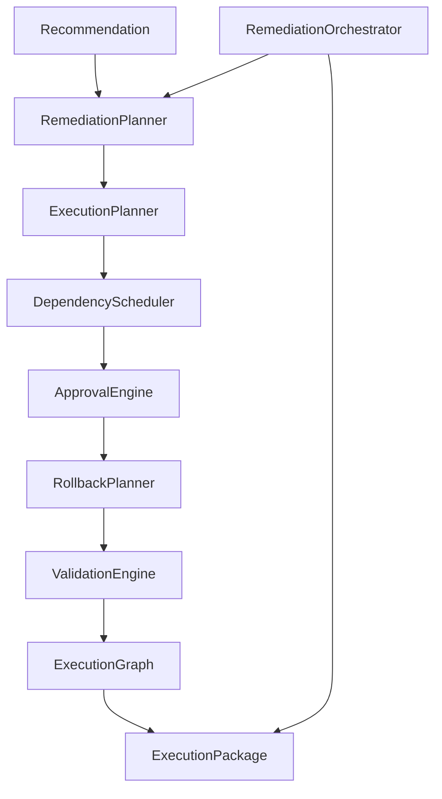

# 04 — Remediation System

| Field | Value |
|-------|-------|
| Review Version | 1.0 |
| Review Date | 2026-07-10 |
| Reviewer | Kishore Suzil |
| Status | Approved |
| Code Version | `13d1019` |

---

## 1. Overview

The Remediation System transforms AI recommendations into safe, reviewable, prioritized execution packages. It does **not** execute cloud changes. It produces an `ExecutionPackage` — a structured artifact containing execution steps, approval requirements, rollback commands, validation checks, and a dependency graph — ready for an automation runner.

---

## 2. Purpose

- **Why it exists:** Turns abstract "what should be improved" into concrete "how to improve it safely."
- **Primary responsibilities:** Plan, sequence, approve, rollback-plan, validate, and graph-visualize remediation steps.
- **Never does:** Execute AWS CLI commands, modify cloud resources, or apply Terraform.

---

## 3. Architecture Diagram



---

## 4. Workflow

```
POST /api/v1/ai/actions/remediation/{resource_id}
    ↓
AIEngine.build_orchestration(resource_id)
    ↓
RemediationOrchestrator.build_package(resource_id)
    ↓
1. RemediationPlanner.plan_for_resource(resource_id) → List[RemediationPlan]
2. Neo4j query → resource_type
3. ExecutionPlanner.plan(plan) → List[ExecutionStep]
4. DependencyScheduler.schedule(resource_id, steps) → ordered_steps
5. ApprovalEngine.determine_approval(resource_type, priority) → Approval
6. RollbackPlanner.generate_rollback(steps) → RollbackPlan
7. ValidationEngine.generate_validation(resource_type, resource_id) → ValidationPlan
8. ExecutionGraph.build_dag(steps) → ExecutionGraph
9. Sum step ETAs → estimated_duration
    ↓
ExecutionPackage
```

---

## 5. Public APIs

| Method | Path | Purpose |
|--------|------|---------|
| POST | `/api/v1/ai/actions/remediation` | Build environment-wide execution packages |
| POST | `/api/v1/ai/actions/remediation/{resource_id}` | Build single-resource execution package |

### Internal APIs

| Caller | Method | Purpose |
|--------|--------|---------|
| `AIEngine` | `RemediationOrchestrator.build_package()` | Orchestrate full remediation pipeline |
| `RemediationTool` | `RemediationOrchestrator.build_package()` | Chat-driven remediation requests |

---

## 6. Components

| Component | File | Responsibility | Used By | Depends On | Input | Output | Status |
|-----------|------|----------------|---------|------------|-------|--------|--------|
| `RemediationPlanner` | `services/ai/remediation_planner.py` | Maps recommendation → abstract remediation plan | `RemediationOrchestrator` | Neo4j, SecurityOrchestrator | `resource_id` | `List[RemediationPlan]` | ✅ Keep |
| `ExecutionPlanner` | `orchestrator/execution_planner.py` | Maps `RemediationPlan` → concrete CLI steps | `RemediationOrchestrator` | None | `RemediationPlan` | `List[ExecutionStep]` | ✅ Keep |
| `DependencyScheduler` | `orchestrator/dependency_scheduler.py` | Orders steps by resource dependency | `RemediationOrchestrator` | Neo4j | `resource_id`, `steps` | `ordered_steps` | 🟡 Improve |
| `ApprovalEngine` | `orchestrator/approval_engine.py` | Determines approval requirements by risk | `RemediationOrchestrator` | None | `resource_type`, `priority` | `Approval` | 🟡 Move to config |
| `RollbackPlanner` | `orchestrator/rollback_planner.py` | Generates rollback plan for each step | `RemediationOrchestrator` | None | `List[ExecutionStep]` | `RollbackPlan` | 🟡 Expand coverage |
| `ValidationEngine` | `orchestrator/validation_engine.py` | Generates post-change validation checks | `RemediationOrchestrator` | None | `resource_type`, `resource_id` | `ValidationPlan` | 🟡 Expand rules |
| `ExecutionGraph` | `orchestrator/execution_graph.py` | Builds a DAG of execution steps | `RemediationOrchestrator` | None | `List[ExecutionStep]` | `ExecutionGraph` | ✅ Keep |
| `RemediationOrchestrator` | `orchestrator/remediation_orchestrator.py` | Orchestrates all components, assembles `ExecutionPackage` | `AIEngine`, `RemediationTool` | All above | `resource_id` | `List[ExecutionPackage]` | ✅ Keep |
| `OrchestrationModels` | `orchestrator/orchestration_models.py` | Data-class definitions for all orchestration types | All orchestrator components | None | — | `ExecutionStep`, `ExecutionPackage`, `Approval`, `RollbackPlan`, `ValidationPlan` | ✅ Keep |

---

## 7. Data Flow

```
resource_id
    ↓ RemediationPlanner → RemediationPlan(resource_id, issue, priority, actions)
    ↓ ExecutionPlanner → List[ExecutionStep(id, title, action, command, estimated_time, rollback)]
    ↓ DependencyScheduler → ordered List[ExecutionStep]
    ↓ ApprovalEngine → Approval(required: bool, approvers: List[str])
    ↓ RollbackPlanner → RollbackPlan
    ↓ ValidationEngine → ValidationPlan
    ↓ ExecutionGraph → DAG(nodes, edges)
    ↓ ExecutionPackage(resource_id, issue, risk_level, approval, estimated_duration,
                       expected_downtime, automation_level, execution_plan,
                       execution_graph, rollback, validation)
```

---

## 8. Input Models

| Model | Fields | Description |
|-------|--------|-------------|
| `RemediationPlan` | `resource_id: str`, `issue: str`, `priority: str` | Abstract remediation task |

---

## 9. Output Models

| Model | Fields | Description |
|-------|--------|-------------|
| `ExecutionStep` | `id, title, action, command, estimated_time, rollback` | Single concrete step |
| `ExecutionPackage` | `resource_id, issue, risk_level, approval, estimated_duration, expected_downtime, automation_level, execution_plan, execution_graph, rollback, validation` | Full remediation package |

---

## 10. Dependencies

### Internal
- `RemediationPlanner` – abstract plan generation.
- `AIRecommendationEngine` – source of issues/recommendations.
- `SecurityOrchestrator` – security findings fed into plans.

### External
| System | Purpose |
|--------|---------|
| Neo4j | Resource type lookup in `RemediationOrchestrator` and `DependencyScheduler` |

---

## 11. Strengths

- Strong separation of concerns across 9 distinct components.
- Safety-first: rollback generation and validation steps built in.
- Priority-aware sorting of environment packages.
- Fully transformational — never touches cloud resources directly.

---

## 12. Weaknesses

- Approval matrix is hard-coded in `ApprovalEngine`.
- `ExecutionPlanner` relies on string matching (`"SSH" in issue`) — brittle for new issue types.
- No cost estimation per execution step.
- No conflict detection (two steps modifying the same security group).

---

## 13. Current Technical Debt

- [ ] Hard-coded approval matrix in `ApprovalEngine` — should be config-driven.
- [ ] String matching for issue type in `ExecutionPlanner` — should use structured issue types/enums.
- [ ] Estimated duration calculation silently skips steps without "m" in `estimated_time`.
- [ ] No unit tests for any orchestrator component.

---

## 14. Improvements (Future Work)

- Config-driven approval matrix (YAML/JSON).
- Structured `IssueType` enum for `ExecutionPlanner` routing.
- Per-step cost estimation via `pricing_service`.
- Graph-based conflict detection before package creation.
- Pluggable execution backends (Terraform, CloudFormation, AWS CLI).

---

## 15. Roadmap

### Short-Term
- Replace string matching with `IssueType` enum.
- Fix `estimated_duration` calculation for all step formats.

### Long-Term
- Pluggable execution backend abstraction.
- UI visualization of `ExecutionGraph` DAG.
- Config-driven governance policies.

---

## 16. Testing

| Type | Coverage | Notes |
|------|----------|-------|
| Unit Tests | 0% | Not implemented |
| Integration Tests | 0% | Not implemented |
| API Tests | 0% | Not implemented |
| Performance Tests | 0% | Not implemented |

---

## 17. Production Readiness

| Area | Status | Notes |
|------|--------|-------|
| Logging | 🟡 | Basic try/except blocks in orchestrator |
| Metrics | ❌ | Not implemented |
| Retry Logic | ❌ | Not implemented |
| Circuit Breaker | ❌ | Not implemented |
| Monitoring | ❌ | Not implemented |
| Tests | ❌ | No coverage |
| Documentation | ✅ | This document |

---

## 18. Final Verdict

**Decision:** 🟡 Keep and Improve

**Confidence:** 92%

**Priority:** High

**Justification:** Excellent layered architecture. Improvements needed in configurability, testing, and conflict detection — not in fundamental design.

---

## 19. Design Decisions (ADR)

### Decision 1: Purely transformational — no execution
- **Decision:** The Remediation System produces plans; it never executes them.
- **Reason:** Safety. All side-effects are isolated to an external automation runner.
- **Alternatives Considered:** Inline execution within the orchestrator.
- **Why Rejected:** Mixing planning and execution makes it impossible to review before applying.

---

## 20. Security Considerations

- AWS CLI commands in `ExecutionStep.command` contain placeholder IDs — never real credentials.
- Approval requirements enforced by `ApprovalEngine` — CRITICAL issues require human sign-off.
- No secrets or AWS credentials stored in any orchestrator component.
- Rollback plan generated automatically to reduce blast radius of any step failure.

---

## 21. Failure Scenarios

| Failure | Impact | Fallback |
|---------|--------|---------|
| Neo4j unavailable | Resource type defaults to "Resource" | Package generated with generic type |
| `RemediationPlanner` returns empty | No packages generated | Empty list returned to caller |
| Step ETA parsing fails | Duration silently set to 0m | Add default fallback in future |

---

## 22. Performance Characteristics

| Metric | Value |
|--------|-------|
| Expected Response Time | < 2 seconds (no LLM involved) |
| Package Generation | Linear with number of findings |
| Concurrent Requests | No shared state — safe for concurrency |
| Caching | None |

---

## 23. Related Subsystems

| Uses | Used By |
|------|---------|
| Recommendation System | AI Engine |
| Graph System (resource type lookup) | Chat (via RemediationTool) |
| Security System (via RemediationPlanner) | API routes |
