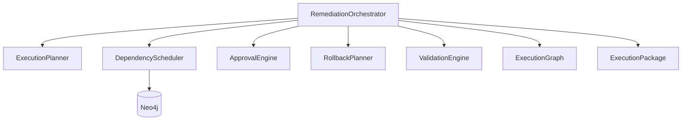

# 05 — Orchestration System

| Field | Value |
|-------|-------|
| Review Version | 1.0 |
| Review Date | 2026-07-10 |
| Reviewer | Kishore Suzil |
| Status | Approved |
| Code Version | `13d1019` |

---

## 1. Overview

The Orchestration System is the **coordinator layer** within the Remediation pipeline. It does not generate recommendations or execute changes — it sequences, approves, and packages the execution steps produced by the `RemediationPlanner`. The core class is `RemediationOrchestrator`, which calls all sub-components (ExecutionPlanner, DependencyScheduler, ApprovalEngine, RollbackPlanner, ValidationEngine, ExecutionGraph) and assembles the final `ExecutionPackage`.

---

## 2. Purpose

- **Why it exists:** Separates the concern of "what steps are needed" (ExecutionPlanner) from "in what order and under what governance" (Orchestration).
- **Primary responsibilities:** Step sequencing, dependency ordering, approval gating, rollback generation, validation planning, DAG construction, and package assembly.
- **Never does:** Execute steps, call AWS APIs, or modify cloud resources.

---

## 3. Architecture Diagram



---

## 4. Workflow

```
resource_id
    ↓ RemediationPlanner → List[RemediationPlan]
    ↓ For each plan:
        ExecutionPlanner.plan(plan) → raw_steps
        DependencyScheduler.schedule(resource_id, raw_steps) → ordered_steps
        ApprovalEngine.determine_approval(resource_type, priority) → approval
        RollbackPlanner.generate_rollback(ordered_steps) → rollback
        ValidationEngine.generate_validation(resource_type, resource_id) → validation
        ExecutionGraph.build_dag(ordered_steps) → exec_graph
        sum(step ETAs) → duration
    ↓ ExecutionPackage
```

For environment-wide orchestration, `build_environment_packages()` iterates all resources and sorts final packages by priority (CRITICAL → HIGH → MEDIUM → LOW → INFO).

---

## 5. Public APIs

| Method | Path | Purpose |
|--------|------|---------|
| POST | `/api/v1/ai/actions/remediation` | Environment-wide orchestration |
| POST | `/api/v1/ai/actions/remediation/{resource_id}` | Single-resource orchestration |

### Internal APIs

| Caller | Method | Purpose |
|--------|--------|---------|
| `AIEngine` | `RemediationOrchestrator.build_package()` | Build resource package |
| `AIEngine` | `RemediationOrchestrator.build_environment_packages()` | Build all packages |
| `OrchestrationTool` | `RemediationOrchestrator.build_package()` | Chat-driven orchestration |

---

## 6. Components

| Component | File | Responsibility | Used By | Depends On | Input | Output | Status |
|-----------|------|----------------|---------|------------|-------|--------|--------|
| `RemediationOrchestrator` | `orchestrator/remediation_orchestrator.py` | Top-level coordinator | `AIEngine`, tools | All below | `resource_id` | `List[ExecutionPackage]` | ✅ Keep |
| `ExecutionPlanner` | `orchestrator/execution_planner.py` | Maps abstract plan → concrete CLI steps | `RemediationOrchestrator` | `RemediationPlan` | `RemediationPlan` | `List[ExecutionStep]` | ✅ Keep |
| `DependencyScheduler` | `orchestrator/dependency_scheduler.py` | Orders steps by resource dependency | `RemediationOrchestrator` | Neo4j | steps | ordered steps | 🟡 Improve |
| `ApprovalEngine` | `orchestrator/approval_engine.py` | Determines approval requirements | `RemediationOrchestrator` | None | resource_type, priority | `Approval` | 🟡 Config-driven |
| `RollbackPlanner` | `orchestrator/rollback_planner.py` | Generates compensating commands | `RemediationOrchestrator` | None | steps | `RollbackPlan` | 🟡 Expand |
| `ValidationEngine` | `orchestrator/validation_engine.py` | Post-change validation steps | `RemediationOrchestrator` | None | resource_type, resource_id | `ValidationPlan` | 🟡 Expand |
| `ExecutionGraph` | `orchestrator/execution_graph.py` | DAG of execution steps | `RemediationOrchestrator` | None | steps | `ExecutionGraph` | ✅ Keep |
| `OrchestrationModels` | `orchestrator/orchestration_models.py` | Data-class definitions | All orchestrator components | None | — | `ExecutionStep`, `ExecutionPackage`, `Approval`, `RollbackPlan`, `ValidationPlan` | ✅ Keep |

---

## 7. Data Flow

```
RemediationPlan(resource_id, issue, priority)
    ↓ ExecutionPlanner → List[ExecutionStep]
    ↓ DependencyScheduler → List[ExecutionStep] (ordered)
    ↓ ApprovalEngine → Approval(required, approvers)
    ↓ RollbackPlanner → RollbackPlan
    ↓ ValidationEngine → ValidationPlan
    ↓ ExecutionGraph → DAG
    ↓ ExecutionPackage(resource_id, issue, risk_level, approval, estimated_duration,
                       expected_downtime, automation_level, execution_plan,
                       execution_graph, rollback, validation)
```

---

## 8. Input Models

| Model | Fields | Description |
|-------|--------|-------------|
| `RemediationPlan` | `resource_id: str`, `issue: str`, `priority: str` | Abstract remediation task |

---

## 9. Output Models

| Model | Fields | Description |
|-------|--------|-------------|
| `ExecutionStep` | `id, title, action, command, estimated_time, rollback` | Single concrete step |
| `Approval` | `required: bool`, `approvers: List[str]` | Approval requirement |
| `RollbackPlan` | `steps: List[RollbackStep]` | Compensating commands |
| `ValidationPlan` | `checks: List[ValidationCheck]` | Post-change validation |
| `ExecutionPackage` | Full package — see Remediation System | Final deliverable |

---

## 10. Dependencies

### Internal
- `RemediationPlanner` – source of `RemediationPlan` objects.
- `OrchestrationModels` – shared data-class definitions.

### External
| System | Purpose |
|--------|---------|
| Neo4j | Resource type lookup in `DependencyScheduler` and orchestrator |

---

## 11. Strengths

- Clear single-responsibility for each orchestrator component.
- Priority-sorted output for environment-wide packages.
- DAG construction enables future UI visualization.
- Safety guarantee: rollback and validation are always generated.

---

## 12. Weaknesses

- `ApprovalEngine` approval matrix is hard-coded.
- `ExecutionPlanner` uses fragile string matching for issue routing.
- Duration calculation skips steps with non-"m" time units.
- Resource type defaults to `"Resource"` if Neo4j is unavailable — may affect approval logic.

---

## 13. Current Technical Debt

- [ ] Hard-coded approval policy in `ApprovalEngine`.
- [ ] String matching in `ExecutionPlanner` for issue type routing.
- [ ] Silent fallback to `"Resource"` type when Neo4j unavailable.
- [ ] Duration parsing assumes "m" suffix — brittle.
- [ ] No unit tests.

---

## 14. Improvements (Future Work)

- Config-driven approval matrix.
- `IssueType` enum for structured routing in `ExecutionPlanner`.
- Conflict detection: check if two steps modify the same resource.
- Cost estimation per step via `pricing_service`.
- Pluggable backends: same `ExecutionPackage` rendered as Terraform, CloudFormation, or CLI.

---

## 15. Roadmap

### Short-Term
- Replace string matching with structured `IssueType` enum.
- Add unit tests for `ApprovalEngine` and `ExecutionPlanner`.

### Long-Term
- Config-driven governance (YAML approval policies).
- Pluggable execution backend abstraction.
- UI graph visualization of `ExecutionGraph` DAG.

---

## 16. Testing

| Type | Coverage | Notes |
|------|----------|-------|
| Unit Tests | 0% | Not implemented |
| Integration Tests | 0% | Not implemented |
| API Tests | 0% | Not implemented |
| Performance Tests | 0% | Not implemented |

---

## 17. Production Readiness

| Area | Status | Notes |
|------|--------|-------|
| Logging | 🟡 | Try/except blocks in orchestrator only |
| Metrics | ❌ | Not implemented |
| Retry Logic | ❌ | Not implemented |
| Circuit Breaker | ❌ | Not implemented |
| Monitoring | ❌ | Not implemented |
| Tests | ❌ | No coverage |
| Documentation | ✅ | This document |

---

## 18. Final Verdict

**Decision:** 🟡 Keep and Improve

**Confidence:** 92%

**Priority:** High

**Justification:** Architecture is solid. Investment should go into configurability, testing, and conflict detection rather than redesign.

---

## 19. Design Decisions (ADR)

### Decision 1: Orchestrator assembles all sub-components
- **Decision:** `RemediationOrchestrator` owns the full assembly pipeline.
- **Reason:** Single point of control for package creation. All sub-components remain decoupled from each other.
- **Alternatives Considered:** Each sub-component returns to a pipeline builder.
- **Why Rejected:** Adds unnecessary abstraction for current scale.

---

## 20. Security Considerations

- Approval requirements enforced programmatically — CRITICAL always requires manual approval.
- AWS CLI commands in steps are templates with placeholder IDs — no real credentials.
- No secrets stored in any orchestrator component.

---

## 21. Failure Scenarios

| Failure | Impact | Fallback |
|---------|--------|---------|
| Neo4j unavailable | Resource type defaults to "Resource" | Approval may be incorrect |
| `RemediationPlanner` returns empty | No packages produced | Empty list returned |
| Duration parsing error | Duration silently 0 | Add fallback default |

---

## 22. Performance Characteristics

| Metric | Value |
|--------|-------|
| Expected Response Time | < 2 seconds |
| Scaling | Linear with number of findings |
| Concurrent Requests | Stateless — safe for concurrency |
| Caching | None |

---

## 23. Related Subsystems

| Uses | Used By |
|------|---------|
| Remediation System (RemediationPlanner) | AI Engine |
| Graph System (Neo4j for resource type) | Chat (OrchestrationTool) |
| OrchestrationModels (shared types) | API routes |
