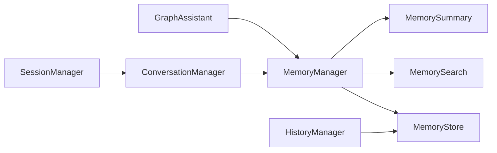

# 06 — Memory System

| Field | Value |
|-------|-------|
| Review Version | 1.0 |
| Review Date | 2026-07-10 |
| Reviewer | Kishore Suzil |
| Status | Approved |
| Code Version | `13d1019` |

---

## 1. Overview

The Memory System provides **per-conversation short-term memory** for the GraphAssistant. It stores message history, conversation context (current resource, current intent), and provides memory summarization for long conversations. The entire store is in-process — no external database.

---

## 2. Purpose

- **Why it exists:** Enables multi-turn conversations by preserving context between user messages.
- **Primary responsibilities:** Append messages, retrieve history, store/retrieve context, search memory by resource, summarize long conversations.
- **Never does:** Persist data across process restarts; share memory across multiple backend instances.

---

## 3. Architecture Diagram



---

## 4. Workflow

```
GraphAssistant.chat(request)
    ↓
MemoryManager.add_message(session_id, "user", message) → appended to MemoryStore
    ↓ [after tool execution and response generation]
MemoryManager.summarize_memory(session_id) → summary string injected into context
MemoryManager.add_message(session_id, "assistant", answer) → appended to MemoryStore
```

---

## 5. Public APIs

No direct public API endpoints. Memory is an internal subsystem accessed only by `GraphAssistant`.

### Internal APIs

| Caller | Method | Purpose |
|--------|--------|---------|
| `GraphAssistant` | `MemoryManager.add_message()` | Persist user and assistant messages |
| `GraphAssistant` | `MemoryManager.summarize_memory()` | Get compressed context for LLM prompt |
| `ConversationManager` | `MemoryManager.get_context()` | Retrieve conversation state |
| `ConversationManager` | `MemoryManager.update_context()` | Update conversation state |
| `HistoryManager` | `MemoryStore.get_messages()` | Retrieve raw message history |

---

## 6. Components

| Component | File | Responsibility | Used By | Depends On | Input | Output | Status |
|-----------|------|----------------|---------|------------|-------|--------|--------|
| `MemoryManager` | `assistant/memory/memory_manager.py` | High-level memory API | `GraphAssistant`, `ConversationManager` | `MemoryStore`, `MemorySearch`, `MemorySummary` | session_id, messages | context, history, summary | ✅ Keep |
| `MemoryStore` | `assistant/memory/memory_store.py` | In-process dict-based storage | `MemoryManager`, `HistoryManager` | None | session_id | `List[Message]`, context dict | ⚠️ Replace with Redis for horizontal scaling |
| `MemorySearch` | `assistant/memory/memory_search.py` | Search messages by resource name | `MemoryManager` | `MemoryStore` | session_id, resource_name | `List[Message]` | ✅ Keep |
| `MemorySummary` | `assistant/memory/memory_summary.py` | Summarizes conversation history | `MemoryManager` | None | `List[Message]` | `str` | ✅ Keep |
| `SessionManager` | `assistant/memory/session_manager.py` | Session creation and lifecycle | `ConversationManager` | None | — | session_id | ✅ Keep |

---

## 7. Data Flow

```
User message → MemoryManager.add_message(session_id, "user", content)
    ↓ MemoryStore._history[session_id].append(Message(role, content))

Memory summary → MemoryManager.summarize_memory(session_id)
    ↓ MemoryStore.get_messages(session_id) → List[Message]
    ↓ MemorySummary.summarize_conversation(messages) → str

Context update → MemoryManager.update_context(session_id, updates)
    ↓ MemoryStore._context[session_id].update(updates)
```

---

## 8. Input Models

| Model | Fields | Description |
|-------|--------|-------------|
| `Message` | `role: str`, `content: str` | A single conversation turn |
| `ConversationContext` | `conversation_id: str`, `current_resource: str`, `current_intent: str` | Current conversation state |

---

## 9. Output Models

| Model | Fields | Description |
|-------|--------|-------------|
| `List[Message]` | `role, content` | Conversation history |
| `ConversationContext` | `conversation_id, current_resource, current_intent` | Current state |
| `str` (summary) | Compressed conversation summary | For LLM prompt injection |

---

## 10. Dependencies

### Internal
- `assistant_models.py` – `Message` and `ConversationContext` data classes.

### External
| System | Purpose |
|--------|---------|
| None | Entirely in-process |

---

## 11. Strengths

- Zero latency — all reads/writes are in-memory dictionary operations.
- Clean separation between storage (`MemoryStore`), search (`MemorySearch`), and summarization (`MemorySummary`).
- `MemoryManager` provides a high-level API — callers never interact with `MemoryStore` directly.
- Session management is isolated in `SessionManager`.

---

## 12. Weaknesses

- **Ephemeral:** All memory is lost on process restart.
- **Not horizontally scalable:** Multiple backend instances cannot share memory.
- No TTL or automatic session expiration — long-running processes accumulate stale sessions.
- No persistence for audit or debugging purposes.

---

## 13. Current Technical Debt

- [ ] `MemoryStore` is in-process only — blocks horizontal scaling.
- [ ] No session TTL or eviction policy.
- [ ] No persistence for debugging or audit.
- [ ] `MemorySummary` strategy is not documented — unclear if it uses LLM or simple truncation.

---

## 14. Improvements (Future Work)

- Replace `MemoryStore` with a Redis-backed implementation (same interface, no upstream changes).
- Add session TTL with automatic eviction.
- Optionally persist conversation summaries to PostgreSQL for audit.

---

## 15. Roadmap

### Short-Term
- Document `MemorySummary` strategy.
- Add session TTL to `MemoryStore`.

### Long-Term
- Redis-backed `MemoryStore` implementation.
- Persistent conversation summaries in PostgreSQL.

---

## 16. Testing

| Type | Coverage | Notes |
|------|----------|-------|
| Unit Tests | 0% | Not implemented |
| Integration Tests | 0% | Not implemented |
| API Tests | N/A | No public APIs |
| Performance Tests | 0% | Not implemented |

---

## 17. Production Readiness

| Area | Status | Notes |
|------|--------|-------|
| Logging | ❌ | No logging in memory components |
| Metrics | ❌ | Not implemented |
| Retry Logic | N/A | In-process, no network calls |
| Circuit Breaker | N/A | In-process |
| Monitoring | ❌ | No session count or memory usage metrics |
| Tests | ❌ | No coverage |
| Documentation | ✅ | This document |

---

## 18. Final Verdict

**Decision:** 🟡 Keep and Improve

**Confidence:** 85%

**Priority:** Medium

**Justification:** Design is correct for a single-instance deployment. The critical gap is horizontal scalability — must be addressed before multi-instance deployment.

---

## 19. Design Decisions (ADR)

### Decision 1: In-process memory store (ADR-004)
- See [ADR-004-Conversation_Memory.md](../adr/ADR-004-Conversation_Memory.md) for the full decision record.

---

## 20. Security Considerations

- Conversation history contains user queries and AI responses — may include resource IDs and cloud configuration details.
- No external persistence — data does not leave the process.
- No authentication on memory access — all callers within the process have full access.

---

## 21. Failure Scenarios

| Failure | Impact | Fallback |
|---------|--------|---------|
| Process restart | All conversation memory lost | User must start a new conversation |
| Memory leak (no eviction) | Process OOM over time | Add TTL-based eviction |

---

## 22. Performance Characteristics

| Metric | Value |
|--------|-------|
| Message Append Latency | < 1 ms |
| History Retrieval Latency | < 1 ms |
| Max Sessions | Unbounded (no eviction) |
| Max Messages per Session | Unbounded |

---

## 23. Related Subsystems

| Uses | Used By |
|------|---------|
| `assistant_models.py` (Message, ConversationContext) | Graph Assistant |
| None (no external dependencies) | Conversation Manager, History Manager |
