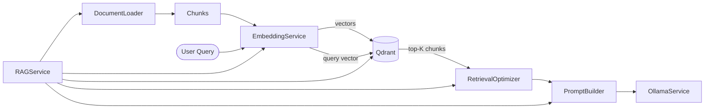

# 07 — RAG / Knowledge System

| Field | Value |
|-------|-------|
| Review Version | 1.0 |
| Review Date | 2026-07-10 |
| Reviewer | Kishore Suzil |
| Status | Approved |
| Code Version | `13d1019` |

---

## 1. Overview

The RAG (Retrieval-Augmented Generation) / Knowledge System indexes cloud documentation and best-practice guides into a Qdrant vector store and retrieves relevant content at query time to ground the LLM's responses. It is used by the `DocumentationTool` in the chat pipeline to answer documentation questions without hallucination.

---

## 2. Purpose

- **Why it exists:** LLMs hallucinate domain-specific knowledge. RAG grounds responses in indexed, authoritative documentation.
- **Primary responsibilities:** Document indexing (chunk, embed, upsert), similarity retrieval, and context injection into LLM prompts.
- **Never does:** Generate responses itself; it only retrieves relevant context. Response generation is handled by `ResponseGenerator` and `OllamaProvider`.

---

## 3. Architecture Diagram



---

## 4. Workflow

### Indexing (offline / on-demand)
```
document (title, content, metadata)
    ↓ DocumentLoader.split_text() → chunks
    ↓ EmbeddingService.get_embedding(chunk.content) → vector
    ↓ QdrantService.upsert_vectors([{id, vector, payload}])
    ↓ {success: bool, chunks_count: int}
```

### Retrieval (per chat request)
```
user_message
    ↓ EmbeddingService.get_embedding(user_message) → query_vector
    ↓ QdrantService.search(query_vector, top_k) → List[ScoredPoint]
    ↓ RetrievalOptimizer.filter(results, min_score=0.65) → filtered_results
    ↓ CategoryMapper.map(intent, context) → category_filter (optional)
    ↓ PromptBuilder.build(query, context=filtered_chunks) → prompt
    ↓ OllamaService.generate(prompt) → answer
```

---

## 5. Public APIs

| Method | Path | Purpose |
|--------|------|---------|
| POST | `/api/v1/ai/rag/index` | Index a document into Qdrant |
| GET | `/api/v1/ai/rag/search` | Search the knowledge base |

### Internal APIs

| Caller | Method | Purpose |
|--------|--------|---------|
| `DocumentationTool` | `RAGService.query()` | Retrieve docs for chat context |
| `index_aws_docs.py` | `RAGService.index_directory()` | Batch-index local AWS docs |

---

## 6. Components

| Component | File | Responsibility | Used By | Depends On | Input | Output | Status |
|-----------|------|----------------|---------|------------|-------|--------|--------|
| `RAGService` | `services/ai/rag_service.py` | Top-level RAG coordinator | `DocumentationTool`, indexing scripts | `EmbeddingService`, `QdrantService`, `DocumentLoader`, `PromptBuilder`, `RetrievalOptimizer`, `CategoryMapper` | query or document | answer or `{success, chunks_count}` | ✅ Keep |
| `EmbeddingService` | `services/ai/embedding_service.py` | Generates text embeddings via Ollama | `RAGService` | Ollama (`nomic-embed-text`) | `str` | `List[float]` | ✅ Keep |
| `QdrantService` | `services/ai/qdrant_service.py` | Vector store CRUD and search | `RAGService` | Qdrant | `List[Point]`, query vector | `List[ScoredPoint]` | ✅ Keep |
| `DocumentLoader` | `services/ai/document_loader.py` | Splits documents into chunks | `RAGService` | None | raw document | `List[Chunk]` | ✅ Keep |
| `RetrievalOptimizer` | `services/ai/retrieval_optimizer.py` | Filters low-score results, re-ranks | `RAGService` | None | `List[ScoredPoint]` | `List[ScoredPoint]` | 🟡 Improve (add re-ranking) |
| `CategoryMapper` | `services/ai/category_mapper.py` | Maps intent/context to doc category | `RAGService` | None | intent, context | category string | ✅ Keep |
| `PromptBuilder` | `services/ai/prompt_builder.py` | Builds LLM prompts from query + context | `RAGService` | None | query, context, architecture_context | `str` | ✅ Keep |

---

## 7. Data Flow

```
Indexing:
Document → split → List[Chunk] → embed → List[Vector] → upsert → Qdrant

Retrieval:
user_query → embed → query_vector → Qdrant.search(top_k=5) → List[ScoredPoint]
    → RetrievalOptimizer.filter(min_score=0.65) → filtered_chunks
    → PromptBuilder.build(query, context=filtered_chunks) → prompt
    → OllamaService.generate(prompt) → answer
```

---

## 8. Input Models

| Model | Fields | Description |
|-------|--------|-------------|
| Document | `title: str`, `content: str`, `metadata: Dict` | Document to index |
| Query | `str` | User query for retrieval |

---

## 9. Output Models

| Model | Fields | Description |
|-------|--------|-------------|
| `IndexResult` | `success: bool`, `document_id: str`, `chunks_count: int` | Indexing result |
| `ScoredPoint` | `id, score, payload` | Retrieved chunk with relevance score |

---

## 10. Dependencies

### Internal
- `PromptBuilder` – prompt construction from retrieved context.
- `OllamaService` – LLM generation (for retrieval + generation pipeline).

### External
| System | Purpose |
|--------|---------|
| Qdrant | Vector storage and similarity search |
| Ollama | Embedding generation (`nomic-embed-text`) and LLM generation |

---

## 11. Strengths

- Fully self-hosted — no external API calls for embeddings or generation.
- Modular design: embedding, storage, retrieval, and generation are independently swappable.
- `RetrievalOptimizer` with min-score filtering reduces irrelevant results.
- `CategoryMapper` enables targeted retrieval by documentation category.
- Collection-per-domain (`cloud_docs`, `security_docs`) for domain-specific retrieval.

---

## 12. Weaknesses

- No re-ranking (cross-encoder) — semantic similarity alone may surface irrelevant chunks.
- Chunk quality depends on `DocumentLoader` split size and overlap settings.
- No automatic re-indexing when source documentation changes.
- Single collection for all cloud documentation — no fine-grained access control.

---

## 13. Current Technical Debt

- [ ] No re-ranking step after vector retrieval.
- [ ] Chunk size and overlap are not documented or configurable.
- [ ] No automatic index refresh when documentation updates.
- [ ] `PromptBuilder` has two implementations (`services/ai/prompt_builder.py` and `services/llm/prompt_builder.py`) — potential confusion.

---

## 14. Improvements (Future Work)

- Add cross-encoder re-ranking for better retrieval precision.
- Make chunk size/overlap configurable via env vars.
- Add a document versioning and refresh mechanism.
- Consolidate `PromptBuilder` implementations.

---

## 15. Roadmap

### Short-Term
- Document chunk configuration.
- Clarify which `PromptBuilder` is authoritative.

### Long-Term
- Cross-encoder re-ranking (e.g., using a local `ms-marco-MiniLM` model).
- Automatic documentation refresh pipeline.
- Hybrid search (dense + sparse/BM25).

---

## 16. Testing

| Type | Coverage | Notes |
|------|----------|-------|
| Unit Tests | 0% | Not implemented |
| Integration Tests | 0% | Not implemented |
| API Tests | 0% | Not implemented |
| Performance Tests | 0% | Not implemented |

---

## 17. Production Readiness

| Area | Status | Notes |
|------|--------|-------|
| Logging | 🟡 | Error logging in indexing only |
| Metrics | ❌ | Not implemented |
| Retry Logic | ❌ | Not implemented |
| Circuit Breaker | ❌ | Not implemented |
| Monitoring | ❌ | Not implemented |
| Tests | ❌ | No coverage |
| Documentation | ✅ | This document |

---

## 18. Final Verdict

**Decision:** ✅ Keep

**Confidence:** 88%

**Priority:** High

**Justification:** Correct architecture for local, private RAG. Key improvements are re-ranking and chunk configurability.

---

## 19. Design Decisions (ADR)

### Decision 1: Qdrant + nomic-embed-text (ADR-003)
- See [ADR-003-RAG.md](../adr/ADR-003-RAG.md) for the full decision record.

---

## 20. Security Considerations

- All documents stored in Qdrant are internal — no public access.
- Qdrant runs in the same private network as the backend.
- No PII or secrets should be indexed in the knowledge base.

---

## 21. Failure Scenarios

| Failure | Impact | Fallback |
|---------|--------|---------|
| Qdrant unavailable | RAG retrieval fails | Chat falls back to LLM-only response (no grounding) |
| Ollama embedding fails | Indexing and retrieval both fail | Return error; no partial results |
| Low retrieval scores | No results pass min-score filter | Return empty context; LLM answers from parametric knowledge |

---

## 22. Performance Characteristics

| Metric | Value |
|--------|-------|
| Embedding Latency | ~100–300 ms per chunk |
| Retrieval Latency | < 100 ms for top-K search |
| Index Size | Unbounded (Qdrant disk-backed) |
| Top-K | 5 (configurable) |
| Min Score Threshold | 0.65 |

---

## 23. Related Subsystems

| Uses | Used By |
|------|---------|
| LLM Provider Layer (Ollama for embeddings) | Graph Assistant (via DocumentationTool) |
| PromptBuilder | API routes (indexing endpoints) |
