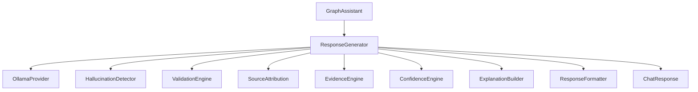

# 08 — Response Generation

| Field | Value |
|-------|-------|
| Review Version | 1.0 |
| Review Date | 2026-07-10 |
| Reviewer | Kishore Suzil |
| Status | Approved |
| Code Version | `13d1019` |

---

## 1. Overview

The Response Generation subsystem transforms a raw LLM output into a rich, validated, attributed `ChatResponse`. It adds confidence scoring, evidence extraction, hallucination detection, source attribution, and explanation building on top of the raw model answer, making the AI assistant's responses more trustworthy and explainable.

---

## 2. Purpose

- **Why it exists:** Raw LLM output can contain hallucinations, lack attribution, and be formatted poorly. This subsystem adds a production-quality layer between the LLM and the API response.
- **Primary responsibilities:** Prompt construction, LLM invocation, hallucination detection, confidence scoring, source attribution, evidence extraction, explanation building, response formatting.
- **Never does:** Query cloud resources, access Neo4j, or make AWS API calls.

---

## 3. Architecture Diagram



---

## 4. Workflow

```
GraphAssistant.generator.generate(question, history_str, context_str, intent, target, tool_responses, request_id)
    ↓
1. PromptTemplates.build_user_prompt(question, history_str, context_str, intent) → prompt
2. [SYSTEM_PROMPT + prompt] → OllamaProvider.generate_response(messages) → raw_answer
3. HallucinationDetector.detect(raw_answer, context_str) → bool (censor if True)
4. ValidationEngine.validate(raw_answer, {}) → bool (replace if invalid)
5. SourceAttribution.attribute(target, tool_responses) → sources
6. EvidenceEngine.extract_evidence(tool_responses, raw_answer) → evidence
7. ConfidenceEngine.calculate(evidence, tools_used, raw_answer) → confidence_score
8. ExplanationBuilder.build_explanation(raw_answer, evidence, sources) → explanation
9. ChatResponse(answer=explanation, intent, resource, sources, confidence, evidence, tools_used)
```

---

## 5. Public APIs

No direct public API. Response generation is triggered internally by `GraphAssistant.chat()`.

### Internal APIs

| Caller | Method | Purpose |
|--------|--------|---------|
| `GraphAssistant` | `ResponseGenerator.generate()` | Generate validated, attributed response |

---

## 6. Components

| Component | File | Responsibility | Used By | Depends On | Input | Output | Status |
|-----------|------|----------------|---------|------------|-------|--------|--------|
| `ResponseGenerator` | `response/response_generator.py` | Orchestrates the full response pipeline | `GraphAssistant` | All below + `OllamaProvider` | question, context, tools | `ChatResponse` | ✅ Keep |
| `HallucinationDetector` | `response/hallucination_detector.py` | Detects ungrounded claims | `ResponseGenerator` | None | raw_answer, context | `bool` | 🟡 Improve detection accuracy |
| `ValidationEngine` | `response/validation_engine.py` | Validates response quality | `ResponseGenerator` | None | raw_answer | `bool` | 🟡 Expand rules |
| `SourceAttribution` | `response/source_attribution.py` | Maps tool responses to sources | `ResponseGenerator` | None | target, tool_responses | `List[str]` | ✅ Keep |
| `EvidenceEngine` | `response/evidence_engine.py` | Extracts supporting evidence | `ResponseGenerator` | None | tool_responses, raw_answer | `List[str]` | ✅ Keep |
| `ConfidenceEngine` | `response/confidence_engine.py` | Scores response confidence | `ResponseGenerator` | None | evidence, tools_used, raw_answer | `float` | ✅ Keep |
| `ExplanationBuilder` | `response/explanation_builder.py` | Formats final explainable answer | `ResponseGenerator` | None | raw_answer, evidence, sources | `str` | ✅ Keep |
| `ResponseFormatter` | `response/response_formatter.py` | Optional dict-format formatter | `ResponseGenerator` | None | explanation, metadata | `Dict` | 🟡 Integrate properly |

---

## 7. Data Flow

```
(question, history_str, context_str, intent, tool_responses)
    ↓ PromptTemplates → messages: [system_prompt, user_prompt]
    ↓ OllamaProvider → raw_answer: str
    ↓ HallucinationDetector → bool (if True, raw_answer replaced)
    ↓ ValidationEngine → bool (if False, raw_answer replaced)
    ↓ SourceAttribution → sources: List[str]
    ↓ EvidenceEngine → evidence: List[str]
    ↓ ConfidenceEngine → confidence: float
    ↓ ExplanationBuilder → explanation: str
    ↓ ChatResponse(answer=explanation, intent, resource, sources, confidence, evidence, tools_used)
```

---

## 8. Input Models

| Model | Fields | Description |
|-------|--------|-------------|
| `question` | `str` | User's original message |
| `history_str` | `str` | Formatted conversation history |
| `context_str` | `str` | Structured tool + memory context |
| `tool_responses` | `List[ToolResponse]` | Results from tool execution |
| `intent` | `str` | Classified intent |
| `target` | `str` | Resolved resource ID |

---

## 9. Output Models

| Model | Fields | Description |
|-------|--------|-------------|
| `ChatResponse` | `answer: str`, `intent: str`, `resource: str`, `sources: List`, `confidence: float`, `evidence: List`, `tools_used: List` | Production response with full attribution |

---

## 10. Dependencies

### Internal
- `OllamaProvider` – LLM text generation.
- `PromptTemplates` – system and user prompt templates.
- `assistant_models.py` – `ChatResponse`, `ToolResponse`.

### External
| System | Purpose |
|--------|---------|
| Ollama | LLM response generation |

---

## 11. Strengths

- Excellent separation: each response quality concern is isolated (hallucination, validation, attribution, confidence, evidence, explanation).
- Explainable AI output with evidence and source attribution.
- Confidence scoring adds trust signal for the user.
- Hallucination detection with context-grounding check.
- Streaming support passed through from `OllamaProvider`.

---

## 12. Weaknesses

- `ResponseFormatter` is created but not integrated into the final response path (commented out).
- `ValidationEngine` validation logic is minimal (not documented).
- `HallucinationDetector` uses simple heuristics — may have false positives.
- Confidence scoring algorithm is not documented.

---

## 13. Current Technical Debt

- [ ] `ResponseFormatter` instantiated but not used in the final `ChatResponse`.
- [ ] `ValidationEngine.validate()` rules are unclear.
- [ ] `HallucinationDetector` algorithm not documented or tested.
- [ ] Confidence calculation logic not documented.

---

## 14. Improvements (Future Work)

- Document and improve `HallucinationDetector` (e.g., NLI-based entailment checking).
- Integrate `ResponseFormatter` into the final `ChatResponse` path.
- Expand `ValidationEngine` with rule-based response quality checks.
- Add confidence score to UI display.

---

## 15. Roadmap

### Short-Term
- Document existing `HallucinationDetector` and `ConfidenceEngine` logic.
- Integrate `ResponseFormatter`.

### Long-Term
- NLI-based hallucination detection for higher accuracy.
- User feedback loop to improve confidence calibration.

---

## 16. Testing

| Type | Coverage | Notes |
|------|----------|-------|
| Unit Tests | 0% | Not implemented |
| Integration Tests | 0% | Not implemented |
| API Tests | N/A | No public API |
| Performance Tests | 0% | Not implemented |

---

## 17. Production Readiness

| Area | Status | Notes |
|------|--------|-------|
| Logging | ❌ | No logging in response components |
| Metrics | ❌ | Not implemented |
| Retry Logic | ❌ | Delegated to OllamaProvider |
| Circuit Breaker | ❌ | Not implemented |
| Monitoring | ❌ | Not implemented |
| Tests | ❌ | No coverage |
| Documentation | ✅ | This document |

---

## 18. Final Verdict

**Decision:** 🟡 Keep and Improve

**Confidence:** 88%

**Priority:** Medium

**Justification:** Architecture is excellent. Primary gaps are undocumented/untested internal logic and the unused `ResponseFormatter`.

---

## 19. Design Decisions (ADR)

### Decision 1: Post-processing pipeline over raw LLM output
- **Decision:** All responses go through hallucination detection, validation, attribution, and explanation building.
- **Reason:** Raw LLM output is not production-ready for a CloudOps platform.
- **Alternatives Considered:** Return raw LLM output.
- **Why Rejected:** Unreliable, unattributed, potentially incorrect responses erode user trust.

---

## 20. Security Considerations

- Response generation has no direct access to cloud resources or secrets.
- LLM output is sanitized by `HallucinationDetector` and `ValidationEngine` before returning to the user.
- Sensitive data in tool responses (e.g., resource IDs) may appear in the final response — acceptable for authenticated users.

---

## 21. Failure Scenarios

| Failure | Impact | Fallback |
|---------|--------|---------|
| Ollama unavailable | `raw_answer` is error JSON from `OllamaProvider` | Error JSON returned as response |
| `HallucinationDetector` flags response | `raw_answer` replaced with "No evidence found." | Graceful degradation |
| `ValidationEngine` fails | `raw_answer` replaced with "Validation failed." | Graceful degradation |

---

## 22. Performance Characteristics

| Metric | Value |
|--------|-------|
| Expected Latency | Dominated by OllamaProvider (2–8 s) |
| Post-processing Overhead | < 50 ms (all in-process) |
| Streaming Support | ✅ Yes (passed through from OllamaProvider) |

---

## 23. Related Subsystems

| Uses | Used By |
|------|---------|
| LLM Provider Layer (OllamaProvider) | Graph Assistant |
| PromptTemplates (context/prompt_templates.py) | API routes |
