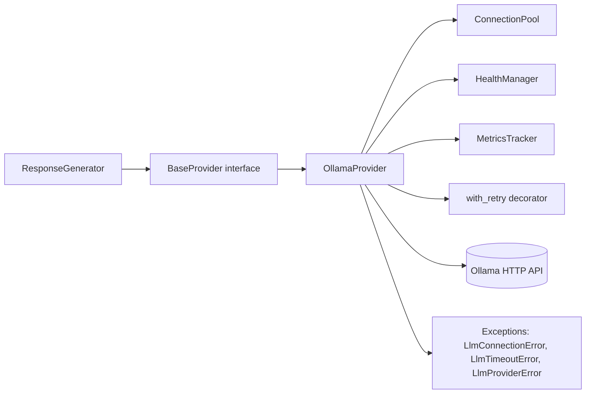

# 09 — LLM Provider Layer

| Field | Value |
|-------|-------|
| Review Version | 1.0 |
| Review Date | 2026-07-10 |
| Reviewer | Kishore Suzil |
| Status | Approved |
| Code Version | `13d1019` |

---

## 1. Overview

The LLM Provider Layer is the **abstraction between the AI subsystems and the underlying language model**. It defines a `BaseProvider` interface and implements `OllamaProvider` as the production backend. The layer adds retry logic, health checking, connection pooling, metrics tracking, and structured error handling, so the rest of the platform never deals with raw HTTP calls to Ollama.

---

## 2. Purpose

- **Why it exists:** Decouples AI subsystems from a specific LLM backend. Swapping from Ollama to OpenAI, AWS Bedrock, or any other provider requires only a new `BaseProvider` implementation.
- **Primary responsibilities:** Generate text responses (synchronous and streaming), check provider health, manage connections, retry on transient failures, track latency/error metrics.
- **Never does:** Business logic, prompt construction, response post-processing, or cloud resource queries.

---

## 3. Architecture Diagram



---

## 4. Workflow

```
ResponseGenerator.provider.generate_response(messages, request_id, stream)
    ↓
OllamaProvider.generate_response()
    ↓
1. HealthManager.get_health_status(session) → {status: "healthy" | "model_missing" | "unreachable"}
   If not healthy → MetricsTracker.record_failure() → return structured error JSON
2. Build payload: {model, messages, stream}
3. @with_retry(max_retries=3) → session.post(ollama_url/api/chat, payload)
4. If stream=True → yield response chunks
   If stream=False → parse JSON → return answer string
5. MetricsTracker.record_success(latency)
```

---

## 5. Public APIs

No HTTP endpoints. This is a pure internal library.

### Internal APIs

| Caller | Method | Purpose |
|--------|--------|---------|
| `ResponseGenerator` | `OllamaProvider.generate_response()` | Generate LLM response |
| `EmbeddingService` | `OllamaService.get_embedding()` | Generate text embeddings |
| `OllamaService` | `OllamaProvider` (indirect) | Used by `rag_service.py` |

---

## 6. Components

| Component | File | Responsibility | Used By | Depends On | Input | Output | Status |
|-----------|------|----------------|---------|------------|-------|--------|--------|
| `BaseProvider` | `llm/base_provider.py` | Abstract interface for LLM providers | `ResponseGenerator`, `GraphAssistant` | None | `messages`, `request_id` | `str` or stream | ✅ Keep |
| `OllamaProvider` | `llm/ollama_provider.py` | Ollama HTTP implementation | `GraphAssistant` | `ConnectionPool`, `HealthManager`, `MetricsTracker`, `with_retry` | messages, request_id | answer string or stream | ✅ Keep |
| `ConnectionPool` | `llm/connection_pool.py` | Manages HTTP session reuse | `OllamaProvider` | `requests.Session` | — | session | ✅ Keep |
| `HealthManager` | `llm/health.py` | Checks Ollama and model availability | `OllamaProvider` | requests | session | health dict | ✅ Keep |
| `MetricsTracker` | `llm/metrics.py` | Tracks latency, success, failure counts | `OllamaProvider` | None | latency (ms) | — | 🟡 Expose metrics externally |
| `with_retry` | `llm/retry.py` | Exponential backoff retry decorator | `OllamaProvider` | None | function | decorated function | ✅ Keep |
| `AISettings` (config) | `llm/config.py` | LLM configuration (URL, model, timeout) | `OllamaProvider` | env vars | — | settings object | ✅ Keep |
| `Exceptions` | `llm/exceptions.py` | Typed exceptions: connection, timeout, provider | `OllamaProvider` | None | — | exception classes | ✅ Keep |
| `LLMModels` | `llm/models.py` | Model configuration data classes | `OllamaProvider` | None | — | model config | ✅ Keep |

---

## 7. Data Flow

```
messages: List[{role: str, content: str}]
    ↓ HealthManager → {status: "healthy"}
    ↓ OllamaProvider._execute_request(url, payload, stream)
    ↓ @with_retry → requests.Session.post(ollama_url, json=payload)
    ↓ response.json()["message"]["content"] → answer string
    ↓ MetricsTracker.record_success(latency_ms)
    → answer: str
```

---

## 8. Input Models

| Model | Fields | Description |
|-------|--------|-------------|
| messages | `List[{role: str, content: str}]` | Chat messages |
| `request_id` | `str` | Tracing identifier |
| `stream` | `bool` | Enable streaming response |

---

## 9. Output Models

| Model | Fields | Description |
|-------|--------|-------------|
| `str` | LLM answer | Non-streaming response |
| `AsyncGenerator[str, None]` | Streaming chunks | Streaming response |
| Error JSON | `{status, code, message, details}` | Structured error |

---

## 10. Dependencies

### Internal
- `AISettings` – Ollama URL, model name, timeout from environment variables.

### External
| System | Purpose |
|--------|---------|
| Ollama | LLM generation and embedding |

---

## 11. Strengths

- `BaseProvider` abstraction makes provider swapping trivial.
- Retry logic with exponential backoff (`@with_retry(max_retries=3, base_delay=1.0)`).
- Health check before every request — returns structured error if unavailable.
- Connection pool reuse — avoids HTTP connection overhead per request.
- Typed exceptions for clean error handling upstream.
- Structured error JSON for model-missing and connection-failed scenarios.
- Internal metrics tracking (latency, success, failure).

---

## 12. Weaknesses

- `MetricsTracker` stores metrics in-process — not exported to Prometheus or any monitoring system.
- No circuit breaker — if Ollama is down, every request still attempts the health check.
- Streaming implementation may not be fully async — should use `httpx` for true async support.
- `OllamaService` in `services/ai/ollama_service.py` is a separate simpler wrapper — risk of divergence.

---

## 13. Current Technical Debt

- [ ] `MetricsTracker` metrics not exported externally (Prometheus, CloudWatch, etc.).
- [ ] No circuit breaker pattern — health check happens on every request.
- [ ] `OllamaService` (`services/ai/ollama_service.py`) duplicates some provider functionality.
- [ ] Streaming via `requests` (synchronous) — should migrate to `httpx` for async support.

---

## 14. Improvements (Future Work)

- Export `MetricsTracker` data to Prometheus / CloudWatch.
- Implement circuit breaker (e.g., after 5 consecutive failures, skip health check and return error immediately for 30 seconds).
- Migrate streaming to `httpx` for true async.
- Consolidate `OllamaService` into `OllamaProvider`.

---

## 15. Roadmap

### Short-Term
- Expose `MetricsTracker` via a `/metrics` endpoint.
- Consolidate `OllamaService` with `OllamaProvider`.

### Long-Term
- Circuit breaker with configurable thresholds.
- Async streaming via `httpx`.
- Support additional providers (OpenAI, Bedrock) behind `BaseProvider`.

---

## 16. Testing

| Type | Coverage | Notes |
|------|----------|-------|
| Unit Tests | 0% | Not implemented |
| Integration Tests | 0% | Not implemented |
| API Tests | N/A | No public API |
| Performance Tests | 0% | Not implemented |

---

## 17. Production Readiness

| Area | Status | Notes |
|------|--------|-------|
| Logging | ✅ | Structured logging via `logging.getLogger("OllamaProvider")` |
| Metrics | 🟡 | Collected but not exported |
| Retry Logic | ✅ | `@with_retry(max_retries=3, base_delay=1.0)` |
| Circuit Breaker | ❌ | Not implemented |
| Monitoring | 🟡 | Health check only |
| Tests | ❌ | No coverage |
| Documentation | ✅ | This document |

---

## 18. Final Verdict

**Decision:** ✅ Keep

**Confidence:** 93%

**Priority:** High

**Justification:** Well-designed provider abstraction with retry, health checks, and structured errors. Key gaps are metrics export and circuit breaker.

---

## 19. Design Decisions (ADR)

### Decision 1: Use Ollama as the local LLM provider (ADR-002)
- See [ADR-002-Ollama.md](../adr/ADR-002-Ollama.md) for the full decision record.

### Decision 2: BaseProvider abstraction
- **Decision:** All LLM calls go through `BaseProvider`, not directly to Ollama.
- **Reason:** Enables provider swapping without changing upstream code.
- **Alternatives Considered:** Direct `requests` calls in `ResponseGenerator`.
- **Why Rejected:** Creates tight coupling to Ollama's API format.

---

## 20. Security Considerations

- Ollama runs in the same private network — no external traffic.
- `OLLAMA_URL` and `OLLAMA_MODEL` are loaded from environment variables, not hard-coded.
- No API keys required for local Ollama.

---

## 21. Failure Scenarios

| Failure | Impact | Fallback |
|---------|--------|---------|
| Ollama server unavailable | `HealthManager` detects → returns `OLLAMA_CONNECTION_FAILED` error JSON | Caller receives structured error |
| Model missing | `HealthManager` detects → returns `MODEL_NOT_FOUND` error JSON | Caller receives structured error |
| Request timeout | `LlmTimeoutError` raised → `@with_retry` retries 3 times → returns error | After 3 retries, structured error returned |
| Unexpected error | `LlmProviderError` raised → retry → structured error | Same as above |

---

## 22. Performance Characteristics

| Metric | Value |
|--------|-------|
| Expected Latency | 2–8 seconds (model dependent) |
| Connection Reuse | ✅ (ConnectionPool) |
| Max Retries | 3 |
| Retry Base Delay | 1 second (exponential) |
| Timeout | Configurable via `OLLAMA_TIMEOUT` env var |

---

## 23. Related Subsystems

| Uses | Used By |
|------|---------|
| Ollama (external) | Response Generation (ResponseGenerator) |
| AISettings (env vars) | RAG System (OllamaService for embeddings) |
