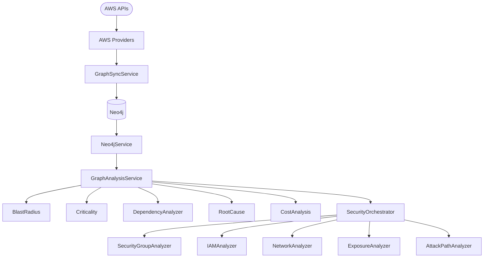

# 10 — Graph System

| Field | Value |
|-------|-------|
| Review Version | 1.0 |
| Review Date | 2026-07-10 |
| Reviewer | Kishore Suzil |
| Status | Approved |
| Code Version | `13d1019` |

---

## 1. Overview

The Graph System models the AWS cloud infrastructure as a **labeled, directed property graph** in Neo4j. It is responsible for building the graph from AWS resource inventory, maintaining graph freshness via synchronization, and providing rich query capabilities (dependency analysis, blast radius, criticality, security analysis, cost analysis, root cause analysis). It is the foundational data layer for all AI subsystems.

---

## 2. Purpose

- **Why it exists:** AWS resources are deeply interconnected. Graph traversal is the most natural and efficient way to model and query these relationships (e.g., "which services depend on this RDS instance?").
- **Primary responsibilities:** Graph construction, synchronization, dependency analysis, blast radius calculation, criticality scoring, security analysis, cost analysis, root cause analysis.
- **Never does:** Recommend changes, execute remediation, or call the LLM.

---

## 3. Architecture Diagram



---

## 4. Workflow

### Graph Sync (scheduled / on-demand)
```
GraphSyncService.sync()
    ↓ For each resource type: EC2, RDS, VPC, Subnet, SG, IAM, ALB, Lambda, etc.
    ↓ AWSRelationshipBuilder.build() → creates CONNECTED_TO, PART_OF, PROTECTED_BY, ASSOCIATED_WITH edges
    ↓ Neo4jService.query() → MERGE nodes and relationships
```

### Graph Query (per request)
```
Tool or Service → Neo4jService.query(cypher, **params) → List[Record]
    or
GraphAnalysisService.method(resource_id) → structured result
```

---

## 5. Public APIs

| Method | Path | Purpose |
|--------|------|---------|
| GET | `/api/v1/graph/criticality/{resource_id}` | Get criticality for a resource |
| GET | `/api/v1/graph/blast-radius/{resource_id}` | Get blast radius for a resource |
| GET | `/api/v1/graph/dependencies/{resource_id}` | Get resource dependencies |
| POST | `/api/v1/graph/sync` | Trigger graph synchronization |

### Internal APIs

| Caller | Method | Purpose |
|--------|--------|---------|
| `DependencyTool` | `GraphAnalysisService.get_dependencies()` | Chat tool |
| `BlastRadiusTool` | `GraphAnalysisService.get_blast_radius()` | Chat tool |
| `SecurityTool` | `SecurityOrchestrator.analyze()` | Chat tool |
| `RemediationPlanner` | `Neo4jService.query()` | Resource lookup |
| `ResourceValidator` | `Neo4jService.query()` | Resource resolution |

---

## 6. Components

| Component | File | Responsibility | Used By | Depends On | Input | Output | Status |
|-----------|------|----------------|---------|------------|-------|--------|--------|
| `Neo4jService` | `graph/neo4j_service.py` | Low-level Cypher query executor | All graph services | Neo4j | Cypher query, params | `List[Record]` | ✅ Keep |
| `GraphSyncService` | `graph/graph_sync_service.py` | Syncs AWS inventory into Neo4j | Background jobs | AWS providers, Neo4jService | — | synced graph | ✅ Keep |
| `AWSRelationshipBuilder` | `graph/aws_relationship_builder.py` | Creates typed edges between resources | `GraphSyncService` | `Neo4jService`, `RelationshipType` | resource pairs | edges in Neo4j | ✅ Keep |
| `GraphAnalysisService` | `graph/graph_analysis_service.py` | High-level graph analysis (blast radius, dependencies, criticality, root cause) | Tools, API routes | `Neo4jService` | `resource_id` | structured analysis result | ✅ Keep |
| `CriticalityService` | `graph/criticality_service.py` | Criticality score calculation | `ArchitectService`, `AIRecommendationEngine` | `GraphAnalysisService` | `resource_id` | criticality dict | ✅ Keep |
| `SecurityOrchestrator` | `graph/analysis/security/orchestrator.py` | Orchestrates all security analyzers | `SecurityTool`, `AIRecommendationEngine` | All security analyzers | `resource_id` | security findings | ✅ Keep |
| `SecurityGroupAnalyzer` | `graph/analysis/security/security_group_analyzer.py` | SG rule analysis | `SecurityOrchestrator` | `Neo4jService` | `resource_id` | SG findings | ✅ Keep |
| `IAMAnalyzer` | `graph/analysis/security/iam_analyzer.py` | IAM privilege analysis | `SecurityOrchestrator` | `Neo4jService` | `resource_id` | IAM findings | ✅ Keep |
| `NetworkAnalyzer` | `graph/analysis/security/network_analyzer.py` | Network exposure analysis | `SecurityOrchestrator` | `Neo4jService` | `resource_id` | network findings | ✅ Keep |
| `ExposureAnalyzer` | `graph/analysis/security/exposure_analyzer.py` | Public exposure detection | `SecurityOrchestrator` | `Neo4jService` | `resource_id` | exposure findings | ✅ Keep |
| `AttackPathAnalyzer` | `graph/analysis/security/attack_path_analyzer.py` | Attack path graph traversal | `SecurityOrchestrator` | `Neo4jService` | `resource_id` | attack paths | ✅ Keep |

---

## 7. Data Flow

```
AWS API response
    ↓ AWS Provider (ec2.py, rds.py, vpc.py, ...)
    ↓ GraphSyncService.sync() → MERGE (resource:Type {id, name, ...}) INTO Neo4j
    ↓ AWSRelationshipBuilder → MERGE (a)-[:RELATIONSHIP_TYPE]->(b) INTO Neo4j

Query time:
    resource_id → Neo4jService.query(cypher) → List[Record]
    resource_id → GraphAnalysisService.get_blast_radius() → {affected_resources, severity, count}
    resource_id → CriticalityService.calculate() → {criticality_score, criticality_level, details}
    resource_id → SecurityOrchestrator.analyze() → {findings, risk_level, recommendations}
```

---

## 8. Input Models

| Model | Fields | Description |
|-------|--------|-------------|
| `resource_id` | `str` | AWS resource identifier (e.g., `i-0123456789abcdef0`) |
| Cypher query | `str` | Raw Cypher query string |
| params | `Dict` | Cypher query parameters |

---

## 9. Output Models

| Model | Fields | Description |
|-------|--------|-------------|
| `List[Record]` | Raw Neo4j records | Low-level query results |
| Blast radius result | `{affected_resources, severity, blast_radius_count}` | Blast radius analysis |
| Criticality result | `{criticality_score, criticality_level, details: {blast_radius, ...}}` | Criticality scoring |
| Security findings | `{findings: List, risk_level: str, recommendations: List}` | Security analysis |

---

## 10. Dependencies

### Internal
- AWS providers (`providers/aws/`) – source of raw resource data.
- `RelationshipType` enum – typed edge labels.

### External
| System | Purpose |
|--------|---------|
| Neo4j | Graph storage and traversal |
| AWS APIs | Source of truth for resource inventory |

---

## 11. Strengths

- Native graph traversal via Cypher — expressive, efficient multi-hop queries.
- Comprehensive security analysis with 5 dedicated analyzers.
- `AWSRelationshipBuilder` creates typed, semantically meaningful edges.
- `GraphAnalysisService` provides a clean high-level API over raw Cypher.
- `CriticalityService` combines blast radius + relationship depth into a single score.

---

## 12. Weaknesses

- Graph sync is not event-driven — changes in AWS are not reflected until the next sync run.
- No graph schema validation — incorrect node labels or missing properties fail silently.
- `Neo4jService` query method is generic — no type safety on query results.
- `ASSOCIATED_WITH` relationship type was missing until recently (bug fix committed).

---

## 13. Current Technical Debt

- [ ] Graph sync is polling-based, not event-driven.
- [ ] Missing `RelationshipType` enum members discovered at runtime (e.g., `ASSOCIATED_WITH` bug).
- [ ] No schema or constraint validation in Neo4j.
- [ ] `Neo4jService` returns raw `List[Record]` — no typed result models.

---

## 14. Improvements (Future Work)

- Event-driven graph sync via AWS EventBridge or SNS.
- Neo4j schema constraints (`CREATE CONSTRAINT ON (n:EC2) ASSERT n.id IS UNIQUE`).
- Typed result models for `GraphAnalysisService` outputs.
- Complete `RelationshipType` enum coverage for all AWS relationship patterns.

---

## 15. Roadmap

### Short-Term
- Add Neo4j schema constraints for all node types.
- Complete `RelationshipType` enum.

### Long-Term
- Event-driven sync via AWS EventBridge.
- Graph schema validation on startup.
- Typed result models for all analysis services.

---

## 16. Testing

| Type | Coverage | Notes |
|------|----------|-------|
| Unit Tests | 0% | Not implemented |
| Integration Tests | 0% | Not implemented |
| API Tests | 0% | Not implemented |
| Performance Tests | 0% | Not implemented |

---

## 17. Production Readiness

| Area | Status | Notes |
|------|--------|-------|
| Logging | 🟡 | Some error logging in sync service |
| Metrics | ❌ | Not implemented |
| Retry Logic | ❌ | Not implemented |
| Circuit Breaker | ❌ | Not implemented |
| Monitoring | ❌ | Not implemented |
| Tests | ❌ | No coverage |
| Documentation | ✅ | This document |

---

## 18. Final Verdict

**Decision:** ✅ Keep

**Confidence:** 92%

**Priority:** Critical

**Justification:** The graph is the foundational data layer for all AI subsystems. It is well-designed but needs schema enforcement, event-driven sync, and typed result models.

---

## 19. Design Decisions (ADR)

### Decision 1: Neo4j as the graph database (ADR-001)
- See [ADR-001-Neo4j.md](../adr/ADR-001-Neo4j.md) for the full decision record.

---

## 20. Security Considerations

- Neo4j runs in the same private network — no public access.
- Cypher queries in `Neo4jService` use parameterized queries (`$id`) — protected against Cypher injection.
- Resource data in Neo4j may contain sensitive metadata (IP addresses, ARNs, tags).

---

## 21. Failure Scenarios

| Failure | Impact | Fallback |
|---------|--------|---------|
| Neo4j unavailable | All graph queries fail | Services fall back to PostgreSQL or return empty results |
| Sync job fails | Graph becomes stale | Manual trigger via `/api/v1/graph/sync` |
| Missing relationship type | Sync silently skips edges | Fixed by completing `RelationshipType` enum |

---

## 22. Performance Characteristics

| Metric | Value |
|--------|-------|
| Graph Query Latency | < 200 ms (simple queries), < 1 s (multi-hop) |
| Max Graph Depth | 5 hops (configurable) |
| Sync Frequency | Scheduled (see Background Jobs) |
| Neo4j Memory | Depends on graph size (typically 512 MB–2 GB) |

---

## 23. Related Subsystems

| Uses | Used By |
|------|---------|
| AWS Providers (inventory) | Recommendation System |
| Inventory System (source data) | Graph Assistant (via tools) |
| Neo4j (external) | Orchestration System (resource type lookup) |
