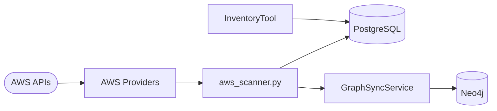

# 11 — Inventory System

| Field | Value |
|-------|-------|
| Review Version | 1.0 |
| Review Date | 2026-07-10 |
| Reviewer | Kishore Suzil |
| Status | Approved |
| Code Version | `13d1019` |

---

## 1. Overview

The Inventory System discovers, fetches, and normalizes AWS resource metadata from the AWS APIs. It provides the raw resource data that feeds the Graph System, the PostgreSQL relational store, and all upstream AI subsystems. It supports over 25 AWS resource types across compute, networking, database, security, and container categories.

---

## 2. Purpose

- **Why it exists:** All analysis (graph, security, cost, AI) depends on an accurate, up-to-date view of the cloud environment.
- **Primary responsibilities:** Discover and fetch AWS resource metadata for all supported resource types; normalize data into a consistent format; persist to PostgreSQL.
- **Never does:** Analyze resources, generate recommendations, or modify cloud resources.

---

## 3. Architecture Diagram



---

## 4. Workflow

```
Scheduled Job / API trigger
    ↓ AWSScanner.scan_all_resources()
    ↓ For each resource type:
        EC2Provider.fetch() / RDSProvider.fetch() / VPCProvider.fetch() / ...
        ↓ normalize to dict
        ↓ PostgreSQL.upsert(resource)
        ↓ GraphSyncService.sync_resource(resource) → Neo4j
```

---

## 5. Public APIs

| Method | Path | Purpose |
|--------|------|---------|
| GET | `/api/v1/inventory` | List all inventoried resources |
| GET | `/api/v1/inventory/{resource_type}` | List resources by type |
| POST | `/api/v1/inventory/refresh` | Trigger a new inventory scan |

### Internal APIs

| Caller | Method | Purpose |
|--------|--------|---------|
| `InventoryTool` | PostgreSQL query | Chat-driven inventory questions |
| `GraphSyncService` | `aws_scanner.py` results | Graph population |
| Background jobs | `AWSScanner.scan_all_resources()` | Scheduled scan |

---

## 6. Components

| Component | File | Responsibility | Used By | Depends On | Input | Output | Status |
|-----------|------|----------------|---------|------------|-------|--------|--------|
| `aws_scanner.py` | `app/aws_scanner.py` | Orchestrates all AWS provider fetches | Background jobs, API routes | All AWS providers | AWS credentials | resource dicts | ✅ Keep |
| `EC2Provider` | `providers/aws/ec2.py` | Fetches EC2 instance metadata | Scanner | boto3 | AWS session | EC2 resource dict | ✅ Keep |
| `RDSProvider` | `providers/aws/rds.py` | Fetches RDS instance metadata | Scanner | boto3 | AWS session | RDS resource dict | ✅ Keep |
| `VPCProvider` | `providers/aws/vpc.py` | Fetches VPC metadata | Scanner | boto3 | AWS session | VPC resource dict | ✅ Keep |
| `SubnetProvider` | `providers/aws/subnet.py` | Fetches Subnet metadata | Scanner | boto3 | AWS session | Subnet resource dict | ✅ Keep |
| `SecurityGroupProvider` | `providers/aws/security_group.py` | Fetches SG rules | Scanner | boto3 | AWS session | SG resource dict | ✅ Keep |
| `IAMProvider` | `providers/aws/iam.py` | Fetches IAM roles and policies | Scanner | boto3 | AWS session | IAM resource dict | ✅ Keep |
| `ALBProvider` | `providers/aws/alb.py` | Fetches ALB/ELB metadata | Scanner | boto3 | AWS session | ALB resource dict | ✅ Keep |
| `LambdaDiscovery` | `providers/aws/lambda_discovery.py` | Fetches Lambda function metadata | Scanner | boto3 | AWS session | Lambda resource dict | ✅ Keep |
| `EKSProvider` | `providers/aws/eks.py` | Fetches EKS cluster metadata | Scanner | boto3 | AWS session | EKS resource dict | ✅ Keep |
| `EBSProvider` | `providers/aws/ebs.py` | Fetches EBS volume metadata | Scanner | boto3 | AWS session | EBS resource dict | ✅ Keep |
| *(25+ more providers)* | `providers/aws/` | Route53, CloudFront, DynamoDB, SQS, EFS, ElastiCache, OpenSearch, WAF, NATGateway, EventBridge, etc. | Scanner | boto3 | AWS session | resource dicts | ✅ Keep |

---

## 7. Data Flow

```
AWS credentials (IAM Role / env vars)
    ↓ boto3.Session
    ↓ EC2Provider.fetch() → List[{id, name, type, state, vpc_id, ...}]
    ↓ PostgreSQL.upsert(resource_type, resource_dict)
    ↓ GraphSyncService.sync(resource_type, resource_dict) → Neo4j node
```

---

## 8. Input Models

| Model | Fields | Description |
|-------|--------|-------------|
| AWS credentials | `AWS_ACCESS_KEY_ID`, `AWS_SECRET_ACCESS_KEY`, `AWS_REGION` | Authentication for AWS APIs |

---

## 9. Output Models

| Model | Fields | Description |
|-------|--------|-------------|
| resource dict | `{id: str, name: str, type: str, region: str, ...}` | Normalized resource metadata |

---

## 10. Dependencies

### Internal
- `GraphSyncService` – populates Neo4j from scan results.
- Background jobs – trigger periodic scans.

### External
| System | Purpose |
|--------|---------|
| AWS APIs (boto3) | Source of all resource metadata |
| PostgreSQL | Persistent relational store for inventory |

---

## 11. Strengths

- Comprehensive coverage: 25+ resource types.
- Normalized output format enables consistent downstream processing.
- Modular provider design — adding a new resource type is a new file only.
- `AWSScanner` as a single orchestrator simplifies scheduling.

---

## 12. Weaknesses

- No delta/incremental sync — full scan on every run is expensive at large scale.
- No rate-limiting or backoff for AWS API throttling.
- Not all providers handle all regions — regional coverage may be incomplete.
- No resource removal detection — deleted resources remain in the store.

---

## 13. Current Technical Debt

- [ ] Full scan every run — no delta detection.
- [ ] No AWS API rate-limit handling (boto3 throttling).
- [ ] Deleted resources not purged from PostgreSQL or Neo4j.
- [ ] Incomplete regional coverage in some providers.

---

## 14. Improvements (Future Work)

- Delta sync using AWS CloudTrail events or resource tags (`LastModified` timestamps).
- Rate-limiting and exponential backoff for AWS API calls.
- Tombstone mechanism for deleted resources.
- Multi-region parallel scanning.

---

## 15. Roadmap

### Short-Term
- Add `try/except` with logging for all provider fetches.
- Detect and mark deleted resources with a `deleted_at` timestamp.

### Long-Term
- Event-driven incremental sync via AWS EventBridge.
- Parallel multi-region scanning.

---

## 16. Testing

| Type | Coverage | Notes |
|------|----------|-------|
| Unit Tests | 0% | Not implemented |
| Integration Tests | 0% | Not implemented |
| API Tests | 0% | Not implemented |
| Performance Tests | 0% | Not implemented |

---

## 17. Production Readiness

| Area | Status | Notes |
|------|--------|-------|
| Logging | 🟡 | Partial — some providers log errors |
| Metrics | ❌ | Not implemented |
| Retry Logic | ❌ | Not implemented |
| Circuit Breaker | ❌ | Not implemented |
| Monitoring | ❌ | Not implemented |
| Tests | ❌ | No coverage |
| Documentation | ✅ | This document |

---

## 18. Final Verdict

**Decision:** ✅ Keep

**Confidence:** 87%

**Priority:** Critical

**Justification:** Correct design — modular provider pattern is the right approach. Gaps are operational (delta sync, rate limiting) rather than architectural.

---

## 19. Design Decisions (ADR)

### Decision 1: Per-resource-type provider pattern
- **Decision:** Each AWS resource type has its own provider module in `providers/aws/`.
- **Reason:** Isolates changes — adding a new resource type doesn't touch existing providers.
- **Alternatives Considered:** Single monolithic scanner.
- **Why Rejected:** Hard to maintain, test, and extend.

---

## 20. Security Considerations

- AWS credentials loaded from environment variables or IAM instance role.
- Least-privilege IAM policy recommended: `ec2:Describe*`, `rds:Describe*`, `iam:List*`, etc. (read-only).
- Resource metadata stored in PostgreSQL — may contain sensitive data (IP addresses, ARNs, tags).

---

## 21. Failure Scenarios

| Failure | Impact | Fallback |
|---------|--------|---------|
| AWS API throttling | Scan fails for throttled resource types | Add retry with backoff |
| PostgreSQL unavailable | Scan results not persisted | Scanner logs error; no recovery |
| Provider exception | That resource type skipped | Other resource types continue scanning |

---

## 22. Performance Characteristics

| Metric | Value |
|--------|-------|
| Full Scan Duration | 30–120 seconds (region and resource count dependent) |
| Concurrent Providers | Sequential (no parallelism currently) |
| Scan Frequency | Configurable via scheduler |

---

## 23. Related Subsystems

| Uses | Used By |
|------|---------|
| AWS APIs (boto3) | Graph System (GraphSyncService) |
| PostgreSQL | Recommendation System (via InventoryTool) |
| Background Jobs | API routes (inventory endpoints) |
