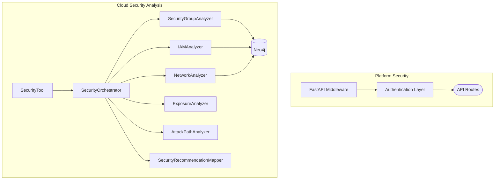

# 13 — Authentication & Security

| Field | Value |
|-------|-------|
| Review Version | 1.0 |
| Review Date | 2026-07-10 |
| Reviewer | Kishore Suzil |
| Status | Approved |
| Code Version | `13d1019` |

---

## 1. Overview

The Authentication & Security subsystem encompasses two distinct concerns: (1) **platform authentication** — how users authenticate to the CloudOps AI API, and (2) **cloud security analysis** — how the platform analyzes the security posture of the monitored AWS environment. Currently, platform-level authentication appears minimal (no JWT/OAuth middleware observed), while cloud security analysis is well-developed via the Graph Security subsystem.

---

## 2. Purpose

- **Why it exists:** Protect the platform APIs from unauthorized access and provide security posture analysis of the AWS environment.
- **Primary responsibilities:**
  - (Cloud Security) Analyze security group rules, IAM privileges, network exposure, attack paths.
  - (Platform) Provide authentication and authorization for API access.
- **Never does:** Modify cloud security configurations (that belongs to the Remediation System).

---

## 3. Architecture Diagram



---

## 4. Workflow

### Cloud Security Analysis
```
ChatAPI / RecommendationEngine / SecurityTool
    ↓ SecurityOrchestrator.analyze(resource_id)
    ↓ SecurityGroupAnalyzer.analyze() → SG findings
    ↓ IAMAnalyzer.analyze() → IAM findings
    ↓ NetworkAnalyzer.analyze() → network findings
    ↓ ExposureAnalyzer.analyze() → exposure findings
    ↓ AttackPathAnalyzer.analyze() → attack paths
    ↓ SecurityRecommendationMapper.map(findings) → recommendations
    ↓ {findings, risk_level, recommendations}
```

---

## 5. Public APIs

| Method | Path | Purpose |
|--------|------|---------|
| GET | `/api/v1/security/analysis/{resource_id}` | Security analysis for a resource |
| GET | `/api/v1/security/exposure` | Environment-wide exposure analysis |

### Internal APIs

| Caller | Method | Purpose |
|--------|--------|---------|
| `SecurityTool` | `SecurityOrchestrator.analyze()` | Chat-driven security analysis |
| `AIRecommendationEngine` | `SecurityOrchestrator.analyze()` | Security-based recommendations |
| `RemediationPlanner` | Security findings | Remediation planning |

---

## 6. Components

| Component | File | Responsibility | Used By | Depends On | Input | Output | Status |
|-----------|------|----------------|---------|------------|-------|--------|--------|
| `SecurityOrchestrator` | `graph/analysis/security/orchestrator.py` | Runs all security analyzers | `SecurityTool`, `AIRecommendationEngine` | All analyzers below | `resource_id` | `{findings, risk_level, recommendations}` | ✅ Keep |
| `SecurityGroupAnalyzer` | `graph/analysis/security/security_group_analyzer.py` | Analyzes SG inbound/outbound rules | `SecurityOrchestrator` | Neo4j | `resource_id` | SG findings | ✅ Keep |
| `IAMAnalyzer` | `graph/analysis/security/iam_analyzer.py` | Detects over-privileged IAM roles | `SecurityOrchestrator` | Neo4j | `resource_id` | IAM findings | ✅ Keep |
| `NetworkAnalyzer` | `graph/analysis/security/network_analyzer.py` | Network exposure and route analysis | `SecurityOrchestrator` | Neo4j | `resource_id` | network findings | ✅ Keep |
| `ExposureAnalyzer` | `graph/analysis/security/exposure_analyzer.py` | Public-facing resource detection | `SecurityOrchestrator` | Neo4j | `resource_id` | exposure findings | ✅ Keep |
| `AttackPathAnalyzer` | `graph/analysis/security/attack_path_analyzer.py` | Graph-based attack path traversal | `SecurityOrchestrator` | Neo4j | `resource_id` | attack paths | ✅ Keep |
| `SecurityRecommendationMapper` | `graph/analysis/security/recommendation_engine.py` | Maps findings → remediation advice | `SecurityOrchestrator` | None | findings | recommendations | 🟡 Rename |
| `SecurityAuditService` | `services/aws/security_audit_service.py` | AWS-level security audit | API routes | boto3 | — | audit results | 🟡 Integrate |
| *Platform Auth* | `app/middleware/` | API authentication/authorization | FastAPI | — | — | — | ❌ Not implemented |

---

## 7. Data Flow

```
resource_id
    ↓ SecurityOrchestrator.analyze()
    ↓ [SG findings] + [IAM findings] + [Network findings] + [Exposure findings] + [Attack paths]
    ↓ SecurityRecommendationMapper.map(all findings) → recommendations
    ↓ {
        findings: List[SecurityFinding],
        risk_level: "CRITICAL" | "HIGH" | "MEDIUM" | "LOW",
        recommendations: List[Recommendation]
      }
```

---

## 8. Input Models

| Model | Fields | Description |
|-------|--------|-------------|
| `resource_id` | `str` | AWS resource identifier |

---

## 9. Output Models

| Model | Fields | Description |
|-------|--------|-------------|
| `SecurityFinding` | `type: str`, `severity: str`, `description: str`, `evidence: Dict` | Single security finding |
| Security analysis result | `{findings, risk_level, recommendations}` | Full analysis output |

---

## 10. Dependencies

### Internal
- `Neo4jService` – security graph queries.
- `SecurityRecommendationMapper` – finding-to-recommendation mapping.

### External
| System | Purpose |
|--------|---------|
| Neo4j | Security relationship queries (SG rules, IAM attachments, network routes) |
| AWS APIs (boto3) | Direct security audit in `SecurityAuditService` |

---

## 11. Strengths

- Excellent multi-analyzer architecture — each security domain is isolated.
- Graph-based attack path analysis is a differentiating feature.
- `SecurityOrchestrator` provides a clean aggregation API.
- All analyzers are composable — can be run individually or together.

---

## 12. Weaknesses

- **Platform authentication is not implemented** — API routes are unprotected.
- `SecurityRecommendationMapper` is misnamed (`recommendation_engine.py`) — causes confusion.
- No RBAC — all authenticated (or unauthenticated) users have full access.
- No org-level isolation — multi-tenant use is not safe.

---

## 13. Current Technical Debt

- [ ] **No platform authentication** — all API routes are publicly accessible.
- [ ] `SecurityRecommendationMapper` misnamed as `recommendation_engine.py`.
- [ ] No RBAC implementation.
- [ ] No org-level multi-tenancy.
- [ ] No audit logging for privileged API operations.

---

## 14. Improvements (Future Work)

- Implement JWT authentication middleware.
- Add RBAC (Admin, ReadOnly, Operator roles).
- Rename `SecurityRecommendationMapper`.
- Add audit logging for all write/action endpoints.
- Add org-level isolation for multi-tenant deployments.

---

## 15. Roadmap

### Short-Term (Critical)
- **Implement JWT authentication** for all API routes.
- Rename `SecurityRecommendationMapper`.

### Long-Term
- RBAC with role definitions.
- Org-level multi-tenancy.
- Audit log to PostgreSQL or CloudTrail.

---

## 16. Testing

| Type | Coverage | Notes |
|------|----------|-------|
| Unit Tests | 0% | Not implemented |
| Integration Tests | 0% | Not implemented |
| API Tests | 0% | Not implemented |
| Penetration Tests | 0% | Not implemented |

---

## 17. Production Readiness

| Area | Status | Notes |
|------|--------|-------|
| Logging | 🟡 | Partial |
| Metrics | ❌ | Not implemented |
| Retry Logic | ❌ | Not implemented |
| Platform Auth | ❌ | **NOT IMPLEMENTED — Critical gap** |
| RBAC | ❌ | Not implemented |
| Audit Logging | ❌ | Not implemented |
| Tests | ❌ | No coverage |
| Documentation | ✅ | This document |

---

## 18. Final Verdict

**Decision:** 🟡 Keep Cloud Security Analysis / ❌ Platform Auth must be implemented

**Confidence (Cloud Security):** 90%

**Confidence (Platform Auth):** N/A — not yet implemented

**Priority:** **Critical (Platform Auth)**

**Justification:** Cloud security analysis is well-designed and production-ready. Platform authentication is a critical production blocker — no API route should be publicly accessible without authentication.

---

## 19. Design Decisions (ADR)

### Decision 1: Graph-based security analysis
- **Decision:** Use Neo4j to store and query security relationships (SG rules, IAM attachments, network routes).
- **Reason:** Enables multi-hop security traversal (e.g., "is there an attack path from the internet to the RDS instance?") that is impossible with SQL queries alone.
- **Alternatives Considered:** AWS Security Hub API only.
- **Why Rejected:** Security Hub provides finding events, not graph-traversal analysis.

---

## 20. Security Considerations

> [!CAUTION]
> Platform APIs are currently unauthenticated. This is a production security blocker. All API routes must be protected by JWT authentication before production deployment.

- **Cloud Security Analysis:** Read-only — no cloud changes.
- **AWS Credentials:** Used for boto3 calls — must be least-privilege read-only IAM policy.
- **Neo4j:** Contains security-sensitive data (SG rules, IAM policies) — access should be restricted.

---

## 21. Failure Scenarios

| Failure | Impact | Fallback |
|---------|--------|---------|
| Neo4j unavailable | Security analysis fails | Return empty findings |
| SecurityGroupAnalyzer raises | That finding type missing | Other analyzers continue |
| AWS API unavailable | Direct audit fails | Fall back to graph-stored data |

---

## 22. Performance Characteristics

| Metric | Value |
|--------|-------|
| Security Analysis Latency | 500 ms – 3 seconds (graph traversal dependent) |
| Attack Path Depth | Up to 5 hops |
| Concurrent Requests | Safe (stateless analyzers) |

---

## 23. Related Subsystems

| Uses | Used By |
|------|---------|
| Graph System (Neo4j) | Recommendation System |
| AWS APIs (direct audit) | Remediation System |
| | Chat (SecurityTool) |
