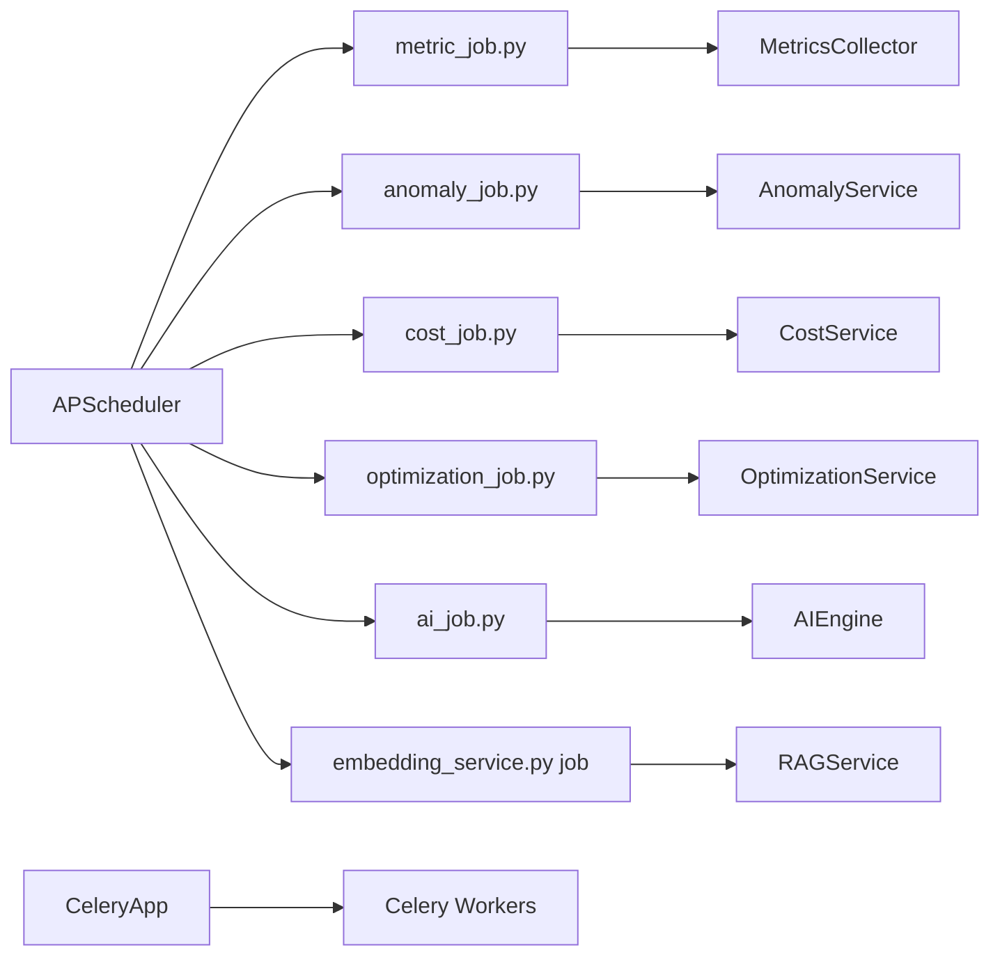

# 14 — Background Jobs & Workers

| Field | Value |
|-------|-------|
| Review Version | 1.0 |
| Review Date | 2026-07-10 |
| Reviewer | Kishore Suzil |
| Status | Approved |
| Code Version | `13d1019` |

---

## 1. Overview

The Background Jobs & Workers subsystem manages all scheduled and asynchronous tasks in the CloudOps AI platform: inventory scanning, metric collection, anomaly detection, cost analysis, AI job processing, and embedding generation. It uses an `APScheduler`-based scheduler (`jobs/scheduler.py`) and a Celery app (`workers/celery_app.py`) for task queuing.

---

## 2. Purpose

- **Why it exists:** Many platform operations (inventory scans, metric collection, anomaly detection) must run periodically without user interaction.
- **Primary responsibilities:** Scheduled execution of: inventory scan, CloudWatch metric collection, anomaly detection, cost optimization, AI analysis, embedding generation.
- **Never does:** Directly serve API requests or block the main application thread.

---

## 3. Architecture Diagram



---

## 4. Workflow

```
Application startup
    ↓ scheduler.py.start()
    ↓ APScheduler registers jobs with cron/interval triggers

Every N minutes (configurable):
    metric_job → MetricsCollector.collect() → PostgreSQL
    anomaly_job → AnomalyService.detect() → alerts
    cost_job → CostService.analyze() → PostgreSQL
    optimization_job → OptimizationService.analyze() → PostgreSQL
    ai_job → AIEngine.recommend() → cached results
    embedding_job → RAGService.index_directory() → Qdrant
```

---

## 5. Public APIs

| Method | Path | Purpose |
|--------|------|---------|
| POST | `/api/v1/jobs/trigger/{job_name}` | Manually trigger a background job |
| GET | `/api/v1/jobs/status` | Get status of background jobs |

---

## 6. Components

| Component | File | Responsibility | Used By | Depends On | Input | Output | Status |
|-----------|------|----------------|---------|------------|-------|--------|--------|
| `scheduler.py` | `jobs/scheduler.py` | APScheduler setup and job registration | `main.py` startup | APScheduler | config | running jobs | ✅ Keep |
| `metric_job.py` | `jobs/metric_job.py` | Scheduled metric collection | Scheduler | `MetricsCollector` | — | stored metrics | ✅ Keep |
| `anomaly_job.py` | `jobs/anomaly_job.py` | Scheduled anomaly detection | Scheduler | `AnomalyService` | — | anomaly records | ✅ Keep |
| `cost_job.py` | `jobs/cost_job.py` | Scheduled cost analysis | Scheduler | `CostService` | — | cost records | ✅ Keep |
| `optimization_job.py` | `jobs/optimization_job.py` | Scheduled cost optimization | Scheduler | `OptimizationService` | — | optimization records | ✅ Keep |
| `ai_job.py` | `jobs/ai_job.py` | Scheduled AI analysis / pre-computation | Scheduler | `AIEngine` | — | cached results | 🟡 Document use case |
| `embedding_service.py` (job) | `jobs/embedding_service.py` | Scheduled document re-indexing | Scheduler | `RAGService` | — | updated Qdrant index | ✅ Keep |
| `celery_app.py` | `workers/celery_app.py` | Celery application definition | Ad-hoc async tasks | Redis/AMQP broker | tasks | task results | 🟡 Clarify usage |

---

## 7. Data Flow

```
APScheduler trigger (interval or cron)
    ↓ job_function()
    ↓ Service.method()
    ↓ PostgreSQL / Qdrant / Neo4j (depending on job)

Celery (separate):
    task.delay() → broker → Celery worker → result
```

---

## 8. Input Models

Jobs are parameterless (scheduled) or receive configuration from environment variables.

---

## 9. Output Models

| Job | Output |
|-----|--------|
| `metric_job` | Metrics stored in PostgreSQL |
| `anomaly_job` | Anomaly records stored in PostgreSQL |
| `cost_job` | Cost records stored in PostgreSQL |
| `optimization_job` | Optimization records stored in PostgreSQL |
| `ai_job` | AI results cached (in-memory or PostgreSQL) |
| `embedding_job` | Updated Qdrant vector index |

---

## 10. Dependencies

### Internal
- All services: `MetricsCollector`, `AnomalyService`, `CostService`, `OptimizationService`, `AIEngine`, `RAGService`.

### External
| System | Purpose |
|--------|---------|
| PostgreSQL | Job result persistence |
| Qdrant | Embedding index updates |
| Neo4j | Graph data for some jobs |
| Redis / AMQP | Celery broker (if used) |
| AWS CloudWatch | Source for metric_job |

---

## 11. Strengths

- APScheduler provides simple, configurable job scheduling without external dependencies.
- Clear separation: each job is a thin wrapper around a service call.
- Celery provides a task queue for heavy async work.
- Jobs can be manually triggered via API.

---

## 12. Weaknesses

- No distributed job locking — if multiple instances run, jobs may execute in parallel and conflict.
- No job failure handling or retry for most jobs.
- `celery_app.py` exists but Celery usage is unclear — may be underused.
- No job execution history or dashboard.
- Jobs silently fail if the underlying service fails.

---

## 13. Current Technical Debt

- [ ] No distributed job locking (critical for multi-instance deployment).
- [ ] No retry logic for failed jobs.
- [ ] `celery_app.py` usage not documented — unclear which tasks use Celery vs. APScheduler.
- [ ] No job execution history persisted to PostgreSQL.
- [ ] `ai_job.py` use case not documented.

---

## 14. Improvements (Future Work)

- Add distributed locking (Redis SETNX) to prevent duplicate job execution.
- Persist job execution history to PostgreSQL.
- Add retry logic with exponential backoff for all jobs.
- Clarify and document Celery vs APScheduler usage split.
- Add a job status dashboard endpoint.

---

## 15. Roadmap

### Short-Term
- Add error logging and retry for all jobs.
- Document `ai_job.py` and Celery usage.

### Long-Term
- Distributed job locking for multi-instance deployment.
- Job execution history and status dashboard.

---

## 16. Testing

| Type | Coverage | Notes |
|------|----------|-------|
| Unit Tests | 0% | Not implemented |
| Integration Tests | 0% | Not implemented |
| API Tests | 0% | Not implemented |
| Performance Tests | 0% | Not implemented |

---

## 17. Production Readiness

| Area | Status | Notes |
|------|--------|-------|
| Logging | 🟡 | Partial logging in some jobs |
| Metrics | ❌ | No job execution metrics |
| Retry Logic | ❌ | Not implemented |
| Distributed Locking | ❌ | Not implemented |
| Job History | ❌ | Not persisted |
| Tests | ❌ | No coverage |
| Documentation | ✅ | This document |

---

## 18. Final Verdict

**Decision:** 🟡 Keep and Improve

**Confidence:** 80%

**Priority:** Medium

**Justification:** Jobs are functional for single-instance deployment. Distributed locking and retry logic are needed before scaling to multiple instances.

---

## 19. Design Decisions (ADR)

### Decision 1: APScheduler for periodic jobs
- **Decision:** Use APScheduler (in-process) for periodic jobs.
- **Reason:** No additional infrastructure required for single-instance deployment.
- **Alternatives Considered:** Celery Beat, AWS EventBridge cron.
- **Why Rejected (Celery Beat):** Requires Redis/AMQP broker setup.
- **Why Rejected (EventBridge):** Adds cloud coupling; overkill for simple periodic jobs.

---

## 20. Security Considerations

- Jobs run with the same IAM credentials as the main process.
- Manual job trigger API (`POST /api/v1/jobs/trigger`) should require authentication (currently unprotected — see Security subsystem).
- Job failure should not expose internal error details via API.

---

## 21. Failure Scenarios

| Failure | Impact | Fallback |
|---------|--------|---------|
| Metric job fails | Metrics not updated | Stale data in PostgreSQL |
| Anomaly job fails | Anomalies not detected | Silent failure |
| Embedding job fails | Qdrant index not updated | RAG retrieval uses stale index |
| APScheduler crash | All jobs stop | Process restart required |

---

## 22. Performance Characteristics

| Metric | Value |
|--------|-------|
| Metric Collection Interval | Configurable (default: 5 min) |
| Full Inventory Scan Duration | 30–120 seconds |
| Embedding Re-index Duration | Minutes (depends on doc count) |
| Job Concurrency | Sequential by default (APScheduler) |

---

## 23. Related Subsystems

| Uses | Used By |
|------|---------|
| Monitoring (MetricsCollector) | All background services |
| Inventory System (AWSScanner) | Triggered on schedule |
| RAG System (RAGService) | Triggered on schedule |
| Graph System (GraphSyncService) | Triggered on schedule |
